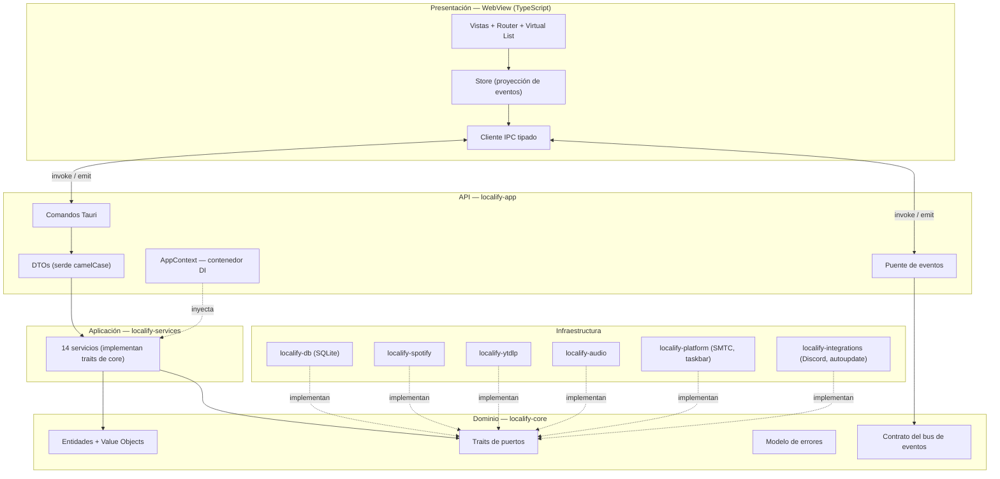
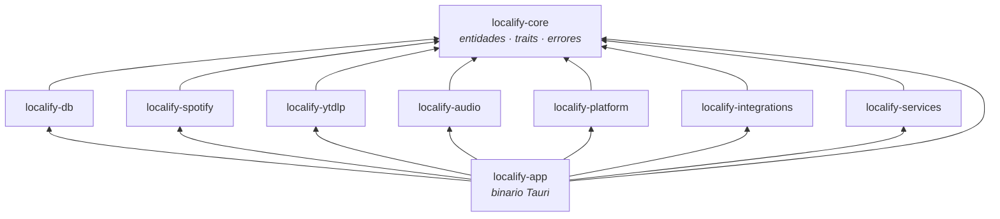
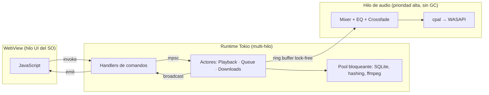

# 01 — Visión general de la arquitectura

> Fase 1 del roadmap. Este documento define los principios, capas y modelo de
> ejecución de Localify. Todo lo demás (módulos, base de datos, API) se deriva
> de aquí.

---

## 1. Qué es Localify

Un **reproductor de música local**. La biblioteca vive en disco, en formato
estándar, y es propiedad del usuario.

- **Spotify** es la fuente de *descubrimiento y metadatos*. Nunca de audio.
- **YouTube (vía yt-dlp)** es la fuente de *audio*. Nunca de metadatos.
- **SQLite** es la fuente de *verdad local*. Siempre se consulta primero.

El usuario no ve descargas, no pulsa "descargar", no gestiona archivos. Pulsa
play y suena.

---

## 2. Principios rectores

| # | Principio | Consecuencia práctica |
|---|-----------|----------------------|
| P1 | **La lógica vive en Rust** | El frontend no decide nada: pinta estado y emite comandos. Cero reglas de negocio en TypeScript. |
| P2 | **Dependencias hacia dentro** | `core` no conoce a nadie. La infraestructura implementa los traits de `core`. |
| P3 | **Traits en las fronteras** | Ningún servicio depende de una implementación concreta de otro. Todo se inyecta como `Arc<dyn Trait>`. |
| P4 | **El hilo principal jamás bloquea** | Todo I/O es `async`. Todo trabajo CPU pesado va a `spawn_blocking` o a un hilo propio. |
| P5 | **El audio es tiempo real** | El hilo de audio no asigna memoria, no toma locks contendidos, no hace I/O. Se comunica por colas lock-free. |
| P6 | **Estado explícito y observable** | Cada cambio relevante emite un evento tipado. La UI es una proyección de esos eventos. |
| P7 | **Nunca dejar corrupción** | Escritura en temporal + `fsync` + rename atómico. Un archivo en la biblioteca es, por definición, completo y verificado. |
| P8 | **Portabilidad por defecto** | El código específico de SO se aísla en un único crate (`localify-platform`) tras traits. Windows hoy, Linux/macOS después sin refactor. |

### Anti-principios (lo que explícitamente NO hacemos)

- No sobreingeniería: no hay CQRS, ni event sourcing, ni microservicios. Es una
  app de escritorio.
- No abstracciones especulativas: un trait existe cuando hay una frontera real
  (test, sustitución de proveedor, o desacople de un hilo).
- No frameworks de UI. No estado global mágico. No ORM.

---

## 3. Capas



**Regla de dependencias:** las flechas de compilación apuntan siempre hacia
`localify-core`. `core` no depende de ningún crate del workspace, ni de
`tokio`, ni de `tauri`, ni de `rusqlite`. Solo de `serde`, `thiserror`,
`chrono` y `async-trait`.

Esto permite:
- testear servicios con dobles en memoria sin tocar disco ni red,
- sustituir Spotify por otro proveedor de metadatos,
- exponer la misma API desde otro frontend (CLI, servidor HTTP) en el futuro.

---

## 4. Mapa de crates (Cargo workspace)



Nótese que **`services` no depende de ningún crate de infraestructura**. Solo
`app` (el ensamblador) conoce las implementaciones concretas y las cablea en el
`AppContext` durante el arranque. Ese es el único punto del programa donde se
nombra un tipo concreto de infraestructura.

| Crate | Responsabilidad | Depende de |
|-------|-----------------|-----------|
| `localify-core` | Entidades, IDs, traits de puerto, errores, contrato de eventos | — |
| `localify-db` | SQLite: pool, migraciones, repositorios, FTS5 | core |
| `localify-spotify` | Cliente HTTP, OAuth client-credentials, rate limit, mapeo a entidades | core |
| `localify-ytdlp` | Sidecar yt-dlp/ffmpeg, búsqueda, scoring, descarga progresiva | core |
| `localify-audio` | Motor de reproducción: decodificación, mezcla, crossfade, EQ, salida | core |
| `localify-platform` | SMTC, thumbnail toolbar, rutas del SO, sidecars | core |
| `localify-musicbrainz` | Cliente de MusicBrainz: búsqueda, ediciones, ISRC, Cover Art Archive | core |
| `localify-integrations` | Discord RPC, letras, aviso de nuevas versiones | core |
| `localify-services` | Los 14 servicios de negocio | core |
| `localify-app` | Comandos Tauri, DTOs, DI, ciclo de vida, bus de eventos | todos |

---

## 5. Modelo de concurrencia

Tres dominios de ejecución que **no comparten locks**:



### 5.1 Servicios sin estado → structs simples

`LibraryService`, `PlaylistService`, `SearchService`, `MetadataService`,
`RecommendationService`, `SettingsService`, `LyricsService` son estructuras
inmutables que reciben sus dependencias por constructor y se comparten como
`Arc<dyn Trait>`. Son `Send + Sync`, reentrantes, y no guardan estado mutable.

### 5.2 Servicios con estado → actores

`PlaybackService`, `QueueService` y `DownloadService` poseen estado mutable con
invariantes temporales. Se implementan como **actores**: una tarea Tokio que
posee el estado en exclusiva y consume un `mpsc::Receiver<Command>`. El handle
público es un struct clonable que envía comandos y espera respuesta por
`oneshot`.

**Por qué actor y no `Arc<Mutex<State>>`:**
- elimina deadlocks por composición de locks,
- serializa las transiciones de estado, que es exactamente la semántica que
  necesita una cola de reproducción,
- permite que el actor haga trabajo en segundo plano entre mensajes (p. ej.
  precargar la siguiente pista para el crossfade),
- el estado nunca se observa a medio actualizar.

### 5.3 El hilo de audio

`cpal` invoca nuestro callback desde un hilo de tiempo real del SO. Dentro de
ese callback está **prohibido**: asignar memoria, tomar un `Mutex`, hacer I/O,
loggear. La comunicación con el actor de reproducción es:

- **Órdenes hacia el audio**: cola SPSC lock-free (`rtrb`) con mensajes
  pre-asignados (play, pause, seek, fade, set-eq).
- **Estado desde el audio**: `AtomicU64` con la posición en frames + una cola
  SPSC de eventos (`TrackEnded`, `Underrun`).
- **Muestras**: los decodificadores viven en hilos normales y empujan PCM a un
  ring buffer por cada voz. El callback solo lee y mezcla.

---

## 6. Bus de eventos

Contrato definido en `core::events::DomainEvent` (enum exhaustivo, serializable).

```
Servicio ──publish──▶ tokio::sync::broadcast<DomainEvent> ──┬──▶ Puente Tauri ──emit──▶ WebView
                                                            ├──▶ Discord RPC
                                                            └──▶ SMTC (Windows)
```

Reglas:
- Los eventos son **hechos consumados en pasado** (`TrackDownloaded`, no
  `DownloadTrack`).
- Un evento nunca lleva payloads grandes: lleva IDs y deltas. El consumidor
  consulta si necesita más.
- Los eventos de alta frecuencia (`PlaybackProgress`) **no** van por el bus:
  el frontend los sondea a 4 Hz mediante un comando barato que lee un atómico.
  Esto evita saturar el puente IPC.
- `broadcast` puede perder mensajes si un consumidor va lento. Por eso todo
  consumidor debe ser capaz de **resincronizarse** pidiendo el estado completo
  (`player_get_state`, `queue_get`). El evento es una optimización, no la
  fuente de verdad.

---

## 7. Modelo de errores

Cada crate define su error con `thiserror`. `core` define `CoreError`, al que
todos convergen en la frontera de servicio.

```rust
// core/src/error.rs
#[derive(Debug, thiserror::Error)]
pub enum CoreError {
    #[error("no encontrado: {entity} {id}")]
    NotFound { entity: &'static str, id: String },
    #[error("entrada inválida: {0}")]
    Invalid(String),
    #[error("conflicto: {0}")]
    Conflict(String),
    #[error("proveedor externo no disponible: {provider}")]
    ProviderUnavailable { provider: &'static str, source: Option<Box<dyn Error + Send + Sync>> },
    #[error("límite de peticiones alcanzado, reintentar en {retry_after_secs}s")]
    RateLimited { retry_after_secs: u64 },
    #[error("no configurado: {0}")]
    NotConfigured(&'static str),
    #[error("error de almacenamiento")]
    Storage(#[source] Box<dyn Error + Send + Sync>),
    #[error("error interno")]
    Internal(#[source] Box<dyn Error + Send + Sync>),
}
```

En la frontera Tauri se serializa a un DTO estable:

```ts
interface ApiError {
  code: "NOT_FOUND" | "INVALID" | "CONFLICT" | "PROVIDER_UNAVAILABLE"
      | "RATE_LIMITED" | "NOT_CONFIGURED" | "STORAGE" | "INTERNAL";
  message: string;        // ya localizado NO — ver abajo
  messageKey: string;     // clave i18n, p.ej. "error.spotify.not_configured"
  details?: Record<string, string>;
}
```

El backend **no traduce**: devuelve una clave i18n y parámetros. El frontend
resuelve el idioma. Así el backend permanece agnóstico de presentación y la API
sirve a cualquier frontend futuro.

---

## 8. Decisiones estructurales clave

Resumidas aquí, justificadas en detalle en [`08-decisions.md`](08-decisions.md).

| Decisión | Elección | Alternativa descartada |
|---|---|---|
| Framework UI | TypeScript + Vite, sin framework | React/Svelte — peso, y P1 hace que el frontend sea trivial |
| Motor de audio | Rust: `cpal` + `symphonia` + mixer propio | Web Audio API — la lógica saldría de Rust y no puede leer archivos en crecimiento |
| Driver SQLite | `rusqlite` (bundled) + pool bloqueante | `sqlx` — async innecesario en fichero local, sin FTS5 cómodo, binario mayor |
| Migraciones | `refinery` (SQL embebido) | Migraciones a mano — sin control de versión del esquema |
| Auth Spotify | Client Credentials, credenciales del usuario en Ajustes | Login OAuth de usuario — el prompt lo prohíbe |
| yt-dlp | Binario sidecar gestionado + JSON por stdout | Bindings/reimplementación — yt-dlp cambia semanalmente |
| Reproducción progresiva | `MediaSource` sobre archivo en crecimiento | Esperar descarga completa — rompe la UX de Spotify |
| Estado con concurrencia | Actores con `mpsc` | `Arc<Mutex<_>>` — deadlocks y estados intermedios visibles |

---

## 9. Requisitos no funcionales y sus objetivos

| Requisito | Objetivo | Cómo se consigue |
|---|---|---|
| Arranque en frío | < 800 ms hasta UI interactiva | Sin trabajo pesado en `setup`; migraciones incrementales; escaneo de biblioteca diferido a tarea de fondo |
| Memoria en reposo | < 150 MB RSS con 10 000 pistas | Nada de cargar la biblioteca en RAM; paginación por SQL; caché LRU de portadas acotada |
| Latencia de búsqueda local | < 30 ms para 50 000 pistas | FTS5 con `prefix='2 3'` + índices; consultas paginadas |
| Time-to-first-audio (local) | < 120 ms | Precarga del decodificador al enfocar la pista; buffer inicial pequeño |
| Time-to-first-audio (remoto) | < 3 s | Reproducción progresiva sobre el `.part` |
| Scroll de listas | 60 fps con 50 000 filas | Virtualización con ventana fija y reciclado de nodos |
| Fluidez de audio | 0 underruns bajo carga | Hilo de audio sin asignaciones ni locks; buffers de 100 ms |

---

## 10. Estructura de datos en disco

```
%APPDATA%/Localify/                 ← configuración y base de datos
├── localify.db                     ← SQLite (WAL)
├── localify.db-wal
├── settings.json                   ← solo lo necesario para arrancar (ruta de datos, idioma)
├── logs/
│   └── localify.2026-08-03.log
└── bin/                            ← sidecars auto-actualizables
    ├── yt-dlp.exe
    └── ffmpeg.exe

<carpeta de biblioteca>/            ← configurable; por defecto %USERPROFILE%/Music/Localify
├── audio/
│   └── <2 primeros chars del id>/  ← sharding para no saturar directorios
│       └── <spotify_id>.opus
├── covers/
│   └── <album_id>_{sm,md,lg}.jpg
└── .tmp/                           ← descargas en curso; se limpia al arrancar
    └── <spotify_id>.<ext>.part
```

`settings.json` existe aparte de SQLite por una razón: la ruta de la biblioteca
y la ubicación de la base de datos deben conocerse **antes** de abrir la base de
datos. El resto de ajustes vive en la tabla `settings`.

---

## 11. Observabilidad

- `tracing` con `tracing-subscriber`, salida a fichero rotado por día + consola
  en `debug`.
- Un `span` por comando Tauri con `command`, `correlation_id` y duración.
- Los servicios emiten eventos a nivel `info` en transiciones de estado y
  `warn`/`error` con contexto suficiente para reproducir el fallo.
- Nunca se loguean credenciales, tokens ni URLs firmadas.
- Comando `diagnostics_get_report` que reúne versiones, rutas, estado de
  sidecars y últimas líneas de log, para soporte.

---

## Siguiente

- [`02-modules.md`](02-modules.md) — cada servicio, su trait y sus invariantes
- [`03-communication.md`](03-communication.md) — flujos entre módulos
- [`04-folder-structure.md`](04-folder-structure.md) — árbol completo
- [`05-database.md`](05-database.md) — esquema SQLite
- [`06-api.md`](06-api.md) — catálogo de comandos y eventos
- [`07-roadmap.md`](07-roadmap.md) — 13 fases
- [`08-decisions.md`](08-decisions.md) — ADRs
