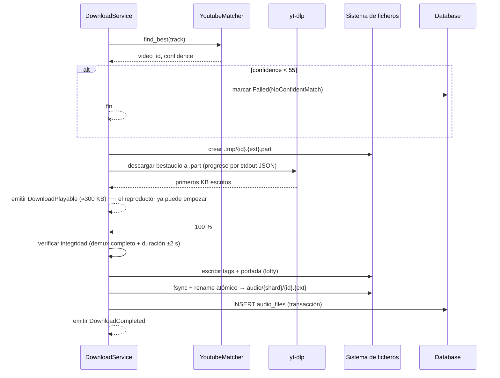

# 02 — Módulos y servicios

Cada servicio se describe con: **responsabilidad**, **trait público**,
**dependencias** (siempre traits, nunca implementaciones), **estado**,
**eventos** que emite e **invariantes** que garantiza.

Convención: todos los traits viven en `localify-core::ports`. Todos son
`async_trait`, `Send + Sync + 'static`, y devuelven `Result<T, CoreError>`.

---

## 0. Entidades del dominio (`localify-core::domain`)

```rust
/// Identificador de pista. Es un ID de Spotify (base62, 22 chars) o,
/// para pistas sin equivalente en Spotify, `local:<uuid-v7>`.
/// Nunca contiene un ID de YouTube.
#[derive(Clone, PartialEq, Eq, Hash, Serialize, Deserialize)]
pub struct TrackId(String);

pub struct ArtistId(String);
pub struct AlbumId(String);
pub struct PlaylistId(Uuid);   // las playlists son locales; las de Spotify se importan y pierden su ID

pub struct Track {
    pub id: TrackId,
    pub title: String,
    pub album: AlbumRef,
    pub artists: Vec<ArtistRef>,   // ordenados; [0] es el principal
    pub duration: Duration,        // duración según Spotify, autoridad para validar coincidencias
    pub track_number: Option<u16>,
    pub disc_number: Option<u16>,
    pub explicit: bool,
    pub isrc: Option<String>,      // clave de oro para desambiguar en YouTube
    pub release_date: Option<NaiveDate>,
    pub popularity: Option<u8>,
    pub added_at: DateTime<Utc>,
}

/// Estado de disponibilidad local. Determina qué hace `play`.
pub enum Availability {
    Absent,                              // solo metadatos
    Downloading { progress: f32 },       // hay un .part reproducible
    Local { path: PathBuf, format: AudioFormat, bytes: u64 },
    Failed { reason: String, attempts: u8 },
}
```

Los value objects (`Duration`, `AudioFormat`, `Quality`, `Bitrate`) son tipos
propios, no primitivos sueltos. `Duration` se almacena en milisegundos como
`u32`; no usamos `std::time::Duration` en la frontera serializable.

---

## 1. Database Service

**Responsabilidad.** Poseer la conexión SQLite, ejecutar migraciones, aplicar
PRAGMAs y ofrecer transacciones. **No contiene lógica de negocio**: expone
repositorios tipados.

```rust
pub trait Database: Send + Sync {
    /// Ejecuta trabajo síncrono de SQLite en el pool bloqueante.
    async fn read<T, F>(&self, f: F) -> Result<T, CoreError>
    where F: FnOnce(&Connection) -> Result<T, CoreError> + Send + 'static, T: Send + 'static;

    async fn write<T, F>(&self, f: F) -> Result<T, CoreError>
    where F: FnOnce(&Transaction) -> Result<T, CoreError> + Send + 'static, T: Send + 'static;

    async fn health(&self) -> Result<DbHealth, CoreError>;
}
```

**Diseño del pool.** SQLite en WAL admite N lectores concurrentes y 1 escritor.
Reflejamos eso exactamente:

- **Pool de lectura**: `min(4, num_cpus)` conexiones, cada una en su hilo del
  pool bloqueante, abiertas en modo solo-lectura.
- **Escritor único**: 1 conexión dedicada tras una cola. Elimina por
  construcción los `SQLITE_BUSY` y las transacciones entrelazadas.

**PRAGMAs de arranque** (justificados en [`05-database.md`](05-database.md)):
`journal_mode=WAL`, `synchronous=NORMAL`, `foreign_keys=ON`,
`busy_timeout=5000`, `temp_store=MEMORY`, `cache_size=-16000`, `mmap_size=256MB`.

**Migraciones.** `refinery`, ficheros `V{n}__{nombre}.sql` embebidos en el
binario. Se ejecutan al arrancar dentro de una transacción. Si una migración
falla, la app arranca **sin biblioteca** en lugar de cerrarse: la ventana se
abre, Ajustes sigue diciendo dónde debería estar la carpeta, y cada operación
devuelve el error de almacenamiento. No se inventan datos para rellenar la
pantalla; ver `localify-services::inerte`.

**Invariantes.** Ninguna operación de SQLite ocurre en un hilo del runtime
async. Ninguna transacción de escritura vive más de una operación lógica.

---

## 2. Settings Service

**Responsabilidad.** Fuente de verdad de la configuración: leer, validar,
persistir y notificar cambios.

```rust
pub trait SettingsService: Send + Sync {
    async fn get(&self) -> Settings;                                  // snapshot completo, barato
    async fn patch(&self, patch: SettingsPatch) -> Result<Settings, CoreError>;
    async fn reset_section(&self, section: SettingsSection) -> Result<Settings, CoreError>;
    fn subscribe(&self) -> watch::Receiver<Settings>;                 // para consumidores en caliente
}

pub struct Settings {
    pub language: Language,                 // Es | En
    pub library_path: PathBuf,
    pub audio: AudioSettings,               // crossfade_ms, eq_profile, gapless, normalización, dispositivo
    pub download: DownloadSettings,         // formato preferido, concurrencia, política de reintentos
    pub spotify: SpotifyCredentials,        // client_id + client_secret (secret cifrado en reposo)
    pub integrations: IntegrationSettings,  // discord on/off
    pub ui: UiSettings,                     // densidad de lista, vista por defecto
}
```

**Diseño.** Los ajustes se guardan en la tabla `settings` como pares
clave/valor con el valor en JSON, salvo `library_path` y `language`, que se
duplican en `settings.json` porque hacen falta antes de abrir la base de datos.
En memoria hay un `watch::Sender<Settings>`; los consumidores (motor de audio,
descargas, integraciones) se suscriben y reaccionan sin reinicio.

**Validación.** `patch` valida antes de persistir: la carpeta de biblioteca
debe existir y ser escribible; `crossfade_ms` ∈ [0, 12000]; las bandas del EQ
∈ [-12, +12] dB. Un patch inválido devuelve `CoreError::Invalid` y **no**
aplica cambios parciales.

**Cambio de carpeta de biblioteca.** Es una operación de migración, no un
simple `patch`: se emite `LibraryPathChangeStarted`, se mueven los ficheros con
verificación, se reescriben las rutas en `audio_files` en una transacción y se
emite `LibraryPathChanged`. Si falla a mitad, la ruta antigua sigue siendo
válida porque las rutas en base de datos son **relativas a la raíz de la
biblioteca**, no absolutas.

**Eventos.** `SettingsChanged { sections }`, `LibraryPathChanged`.

---

## 3. Catálogos de metadatos

Hay cuatro opciones tras el puerto `MetadataProvider`, y el usuario elige en
Ajustes. `ProveedorConmutable` es el que reciben todos los servicios y delega en
el activo, así que cambiar de catálogo es escribir un valor.

| Opción | Credenciales | Qué conoce |
|---|---|---|
| **Combinado** (por defecto) | ninguna | los dos de abajo a la vez |
| YouTube Music | ninguna | lo que hay **subido**: remezclas, versiones de canal |
| MusicBrainz | ninguna | lo **publicado**: ediciones, bandas sonoras, ISRC |
| Spotify | del usuario | catálogo comercial, con géneros y popularidad |

**Por qué el combinado es el valor por defecto.** YouTube Music y MusicBrainz no
compiten, se completan, y elegir uno obliga a acertar *antes* de buscar. El caso
que lo motivó: "casey edwards bury the light" devuelve veinte resultados en
YouTube Music y **ninguno** es la canción —solo covers, porque la original no
está subida como canción—; en MusicBrainz sale la primera.

**Cómo mezcla** (`localify-services::combinado`). Alternando, empezando por
YouTube Music. No hay puntuación común que ordenar: uno mide relevancia de texto
sobre doce millones de grabaciones y el otro reproducciones de vídeo. Alternar
no inventa nada y garantiza que lo mejor de cada uno esté arriba.

Los duplicados **no se filtran ahí**: el servicio de búsqueda ya agrupa por
título canónico y artista, así que la misma canción de los dos catálogos cae en
una sola fila y la otra queda desplegable.

Las consultas por identificador van a **un** catálogo, elegido por la forma del
id: un MBID es un UUID y nada más lo es.

**MusicBrainz: lo que no da.** Popularidad (no existe el concepto), fotos de
artista (están en Wikidata, a dos peticiones más), playlists, y "canciones
populares" de un artista. Sus etiquetas más votadas hacen de géneros. Su cliente
respeta **una petición por segundo** y manda `User-Agent` identificándose: son
las condiciones de uso de un servicio gratuito, y el freno vive dentro del
cliente para que no dependa de que cada llamante se acuerde.

---

## 3b. Spotify Service

**Responsabilidad.** Único punto de contacto con la Web API de Spotify.
Autenticación, rate limiting, reintentos y mapeo a entidades del dominio.

```rust
pub trait SpotifyProvider: Send + Sync {
    async fn status(&self) -> ProviderStatus;                          // Configurado | SinCredenciales | Caído
    async fn search_tracks(&self, q: &str, limit: u8, offset: u16) -> Result<Page<Track>, CoreError>;
    async fn track(&self, id: &TrackId) -> Result<Track, CoreError>;
    async fn tracks(&self, ids: &[TrackId]) -> Result<Vec<Track>, CoreError>;   // batch de 50
    async fn album(&self, id: &AlbumId) -> Result<Album, CoreError>;
    async fn album_tracks(&self, id: &AlbumId) -> Result<Vec<Track>, CoreError>;
    async fn artist(&self, id: &ArtistId) -> Result<Artist, CoreError>;
    async fn artist_top_tracks(&self, id: &ArtistId) -> Result<Vec<Track>, CoreError>;
    async fn public_playlist(&self, id: &str) -> Result<PlaylistImport, CoreError>;
}
```

**Autenticación: Client Credentials.** El usuario **no inicia sesión**. La app
usa el flujo `client_credentials`, que solo requiere un `client_id` y un
`client_secret` de una aplicación del Spotify Developer Dashboard.

Como el proyecto es open source, no podemos incrustar un secret en el
repositorio. Solución en dos niveles:

1. **Build oficial**: `client_id`/`client_secret` inyectados en tiempo de
   compilación vía variables de entorno (`LOCALIFY_SPOTIFY_CLIENT_ID`). No
   están en el código fuente.
2. **Build desde fuente**: si no hay credenciales embebidas, la app pide al
   usuario que pegue las suyas una vez en Ajustes. Se guarda cifrado con DPAPI
   en Windows (`localify-platform` abstrae esto).

Esto satisface "el usuario no necesita iniciar sesión": no hay cuenta de
Spotify implicada, no hay redirección OAuth, no hay navegador. La app entera
funciona sin ello para todo lo que ya está en la biblioteca local.

**Rate limiting.** Spotify devuelve `429` con `Retry-After`. Implementamos:
- limitador de tokens local (conservador: ~10 req/s en ráfaga, 3 sostenidas),
- respeto estricto de `Retry-After`,
- backoff exponencial con jitter para 5xx,
- coalescencia de peticiones idénticas en vuelo (evita N llamadas iguales),
- caché de respuestas por endpoint con TTL en `CacheService`.

**Degradación.** Si Spotify no está disponible o no está configurado, el
servicio devuelve `ProviderUnavailable` / `NotConfigured` y **la aplicación
sigue funcionando por completo sobre la biblioteca local**. Esto no es un caso
de error excepcional, es un modo de operación de primera clase.

**Notas sobre la API (estado 2026).** Varios endpoints (`/recommendations`,
`/audio-features`, `/related-artists`) están restringidos o retirados para
aplicaciones nuevas. Localify **no los necesita**: las recomendaciones son
locales por diseño (requisito del prompt). Las playlists públicas de usuario y
la búsqueda siguen accesibles con client credentials; las playlists
algorítmicas propiedad de Spotify no lo están, y ese caso se reporta al usuario
con un mensaje claro en vez de un fallo genérico.

---

## 4. Metadata Service

**Responsabilidad.** Orquestar la obtención de metadatos y su normalización,
independientemente del proveedor. Es la capa que convierte "algo de Spotify" en
"algo canónico de Localify" y lo persiste.

```rust
pub trait MetadataService: Send + Sync {
    /// Garantiza que la pista existe en la base de datos local con metadatos
    /// completos. Si ya existe y no ha caducado, no toca la red.
    async fn ensure_track(&self, id: &TrackId) -> Result<Track, CoreError>;
    async fn ensure_album(&self, id: &AlbumId) -> Result<Album, CoreError>;
    async fn ensure_artist(&self, id: &ArtistId) -> Result<Artist, CoreError>;

    /// Descarga y cachea la portada en los tres tamaños.
    async fn ensure_cover(&self, album: &AlbumId) -> Result<CoverSet, CoreError>;

    /// Escribe los tags en el archivo de audio ya descargado.
    async fn write_tags(&self, track: &TrackId, file: &Path) -> Result<(), CoreError>;

    async fn refresh_stale(&self, older_than: Duration, limit: u32) -> Result<u32, CoreError>;
}
```

**Dependencias:** `SpotifyProvider`, `Database`, `CacheService`.

**Normalización.** Todo texto que se vaya a usar para comparar (búsqueda en
YouTube, deduplicación, orden) pasa por una función canónica única:
minúsculas → NFKD → eliminación de diacríticos → colapso de espacios →
eliminación de sufijos ruidosos (`- Remastered 2011`, `(Deluxe Edition)`,
`feat. X` cuando ya está en `artists`). El resultado se guarda en columnas
`*_norm` indexadas. **Esta función vive en un solo sitio** y es la misma que
usa el scorer de YouTube; si difieren, el matching se degrada silenciosamente.

**Tags.** Al completarse una descarga se escriben con `lofty`: título, artistas,
álbum, año, número de pista/disco, ISRC, portada embebida y
`LOCALIFY_SPOTIFY_ID`. Esto hace la biblioteca portable: sigue siendo válida
aunque se borre la base de datos, y permite reconstruirla escaneando la carpeta.

---

## 5. Search Service

**Responsabilidad.** Implementar el flujo de búsqueda del prompt: **local
primero, Spotify después, YouTube jamás**.

```rust
pub trait SearchService: Send + Sync {
    async fn search(&self, q: &str, scope: SearchScope, page: Page) -> Result<SearchResults, CoreError>;
    async fn suggest(&self, prefix: &str, limit: u8) -> Result<Vec<Suggestion>, CoreError>;
}

pub struct SearchResults {
    pub local: SearchBucket,             // desde FTS5 — siempre presente, siempre primero
    pub remote: RemoteBucket,            // Ready(..) | Loading | Unavailable(reason) | NotAttempted
    pub query_id: u64,                   // para descartar respuestas obsoletas
}
```

**Estrategia en dos fases.** La búsqueda no es una única respuesta: es un
resultado local inmediato más un refuerzo remoto opcional.

1. Consulta FTS5. Retorna en < 30 ms. La UI ya pinta.
2. **Solo si** los resultados locales son insuficientes (< N coincidencias
   fuertes) y hay conexión y Spotify está configurado, se lanza la consulta
   remota en segundo plano y se emite `SearchRemoteReady { query_id, results }`.

El `query_id` monótono permite al frontend ignorar respuestas de búsquedas ya
superadas por teclas posteriores. Debounce de 180 ms en el frontend para el
disparo remoto; la búsqueda local se ejecuta en **cada** pulsación porque es
barata.

**Deduplicación.** Un resultado remoto cuyo `TrackId` ya existe localmente se
fusiona con el local (no se muestra dos veces) y hereda su `Availability`.

---

## 6. YouTube Match Service (parte de Search Service en el prompt, módulo propio aquí)

**Responsabilidad.** Dado un `Track` con metadatos de Spotify, elegir el mejor
vídeo de YouTube. Es lógica pura y determinista, **separada del proceso de
descarga**, y por tanto testeable con fixtures sin red.

```rust
pub trait YoutubeMatcher: Send + Sync {
    async fn find_best(&self, track: &Track) -> Result<MatchResult, CoreError>;
}

pub struct MatchResult {
    pub video_id: String,
    pub score: f32,
    pub confidence: Confidence,   // High | Medium | Low
    pub breakdown: ScoreBreakdown, // trazabilidad: por qué ganó
    pub candidates_considered: u8,
}
```

**Consultas.** Se emiten varias, en orden, y se detiene en cuanto hay un
candidato de confianza alta:

1. `ytsearch10:"{isrc}"` — si hay ISRC. Coincidencia casi perfecta cuando existe.
2. `https://music.youtube.com/search?q={artista} {título}` — YouTube Music primero.
3. `ytsearch10:{artista} - {título} {álbum}`
4. `ytsearch10:{artista} {título} topic`
5. `ytsearch10:{artista} {título} audio`

**Puntuación.** Cada candidato recibe una puntuación en [0, 100]:

```
score = 100
      · w_duración(Δd)          ← factor multiplicativo, no aditivo
      + bonus_fuente
      + bonus_texto
      − penalizaciones
```

| Componente | Regla | Valor |
|---|---|---|
| **Duración** | `Δd = |dur_yt − dur_spotify|` | `Δd ≤ 2 s` → ×1.00 · `≤ 5 s` → ×0.90 · `≤ 10 s` → ×0.70 · `> 10 s` → ×0.15 · `> 45 s` → **descarte** |
| **Fuente: YouTube Music** | dominio `music.youtube.com` | +30 |
| **Fuente: canal `- Topic`** | sufijo exacto del canal | +28 |
| **Fuente: canal verificado del artista** | nombre canal ≈ artista principal | +22 |
| **Fuente: `Provided to YouTube by`** | en la descripción | +25 |
| **Álbum coincide** | álbum de Spotify en título/descripción | +10 |
| **Título coincide** | similitud Jaro-Winkler sobre texto normalizado | +0…+20 |
| **Artista coincide** | artista principal presente en canal o título | +0…+15 |
| **Penalización ruido** | por cada término prohibido en el título | −40 c/u |
| **Penalización directo** | `live`, `en vivo`, `concert`, `session`, `tiny desk` | −45 |
| **Penalización versión** | `cover`, `karaoke`, `instrumental`, `remix`, `mashup`, `nightcore`, `sped up`, `slowed`, `reverb`, `bass boosted`, `8d`, `lofi`, `mix` | −40 |
| **Penalización vídeo** | `official video`, `music video`, `videoclip` (preferimos el audio) | −8 |
| **Penalización recopilatorio** | duración > 10 min y el track dura < 8 min | −60 |
| **Penalización edad/vistas** | < 1000 vistas y canal desconocido | −15 |

**Excepción obligatoria:** si el término prohibido está **también en el título
de Spotify** (p. ej. *"Live at Wembley"*, *"— Remix"*), no se penaliza; se
convierte en requisito. Sin esta regla, las canciones que legítimamente son
remixes o directos nunca encontrarían coincidencia.

**Umbrales.** `≥ 75` → `High` (descarga automática). `55…75` → `Medium`
(descarga, se registra para posible revisión). `< 55` → `Low`: no se descarga
automáticamente; se marca la pista como `Failed{ reason: NoConfidentMatch }` y
la UI lo indica discretamente en la fila. Nunca se descarga basura en silencio.

**Persistencia.** El resultado se guarda en `youtube_matches` con su
`breakdown`. Si el usuario reporta un match malo, se marca `rejected` y se
vuelve a buscar excluyéndolo. La tabla es un **caché**: borrarla no pierde nada
salvo tiempo.

---

## 7. Download Service

**Responsabilidad.** Convertir "quiero esta pista" en un archivo local completo
y correctamente etiquetado, de forma invisible para el usuario.

```rust
pub trait DownloadService: Send + Sync {
    /// Idempotente. Si ya existe local → devuelve al instante.
    /// Si ya hay descarga en curso → se engancha a ella, no duplica.
    async fn ensure(&self, track: &TrackId, priority: Priority) -> Result<DownloadHandle, CoreError>;
    async fn status(&self, track: &TrackId) -> Result<Availability, CoreError>;
    async fn statuses(&self, tracks: &[TrackId]) -> Result<HashMap<TrackId, Availability>, CoreError>;
    async fn retry_failed(&self) -> Result<u32, CoreError>;
}

pub enum Priority { Immediate, /* el usuario le dio play */  Prefetch /* siguiente en cola */ }

pub struct DownloadHandle {
    /// Ruta reproducible *ya mismo* (el .part) y receptor de progreso.
    pub playable_path: PathBuf,
    pub progress: watch::Receiver<DownloadProgress>,
}
```

**Actor con dos carriles.** El actor mantiene:
- carril `Immediate`: concurrencia 2, sin cola de espera real,
- carril `Prefetch`: concurrencia 2, cede ancho de banda al carril inmediato,
- mapa `TrackId → JobHandle` para deduplicar.

**Pipeline de una descarga:**



**Elección de formato.** `--format` de yt-dlp ordenado por: opus/webm de mayor
bitrate → m4a/AAC de mayor bitrate → mejor audio disponible. Se prefiere
**Opus en contenedor WebM** por dos razones: es el mejor audio que sirve
YouTube (~160 kbps VBR, superior perceptualmente a los 128 kbps de AAC), y
Matroska/WebM está diseñado para ser decodificable en streaming, lo que hace
posible la reproducción progresiva del `.part`. **Nunca se transcodifica**: eso
solo degradaría. FFmpeg se usa para remuxear e inspeccionar, no para recodificar.

**Reglas del prompt, implementadas literalmente:**
- Sin botones de descarga, sin gestor visible: `ensure()` solo se llama desde
  `PlaybackService` y desde el prefetch de cola.
- Cambiar de canción **no cancela** nada: el actor no expone `cancel`. No
  existe en el trait. Un job solo termina completándose o fallando.
- Sin pausa: no existe.
- Nunca archivos corruptos: garantizado por verificación + rename atómico. El
  `.part` vive en `.tmp/`, que se purga al arrancar; un `.part` huérfano nunca
  se confunde con biblioteca.

**Reintentos.** 3 intentos con backoff (2 s, 8 s, 30 s). Errores distinguidos:
red (reintenta), vídeo no disponible (re-matchea excluyendo ese ID),
yt-dlp desactualizado (dispara auto-actualización del sidecar y reintenta una vez).

**Eventos.** `DownloadStarted`, `DownloadPlayable`, `DownloadProgress`
(throttled a 2 Hz por job), `DownloadCompleted`, `DownloadFailed`.

---

## 8. Playback Service

**Responsabilidad.** Traducir intención del usuario ("play", "seek") en órdenes
al motor de audio, coordinando disponibilidad, cola y persistencia de posición.

```rust
pub trait PlaybackService: Send + Sync {
    async fn play_track(&self, id: &TrackId, ctx: PlaybackContext) -> Result<(), CoreError>;
    async fn toggle(&self) -> Result<PlayerState, CoreError>;
    async fn pause(&self) -> Result<(), CoreError>;
    async fn resume(&self) -> Result<(), CoreError>;
    async fn seek(&self, position_ms: u32) -> Result<(), CoreError>;
    async fn next(&self) -> Result<(), CoreError>;
    async fn previous(&self) -> Result<(), CoreError>;   // < 3 s → pista anterior; si no → reinicia
    async fn set_volume(&self, v: Volume) -> Result<(), CoreError>;
    async fn set_repeat(&self, mode: RepeatMode) -> Result<(), CoreError>;
    async fn set_shuffle(&self, on: bool) -> Result<(), CoreError>;
    fn state(&self) -> PlayerState;              // barato: lee atómicos, sin await
}

pub struct PlayerState {
    pub track: Option<TrackId>,
    pub status: PlayStatus,           // Playing | Paused | Buffering | Stopped
    pub position_ms: u32,
    pub duration_ms: u32,
    pub volume: Volume,
    pub repeat: RepeatMode,
    pub shuffle: bool,
    pub buffered_ms: u32,             // relevante durante descarga progresiva
}
```

**Algoritmo de `play_track`** — es el corazón de la app:

```
1. Actualizar la cola según el contexto (álbum, playlist, resultados de búsqueda).
2. availability = download.status(id)
3. match availability:
     Local{path}      → engine.load(path, start_at=0); status = Playing
     Downloading      → engine.load_growing(part_path); status = Buffering→Playing
     Absent | Failed  → status = Buffering
                        handle = download.ensure(id, Immediate)
                        esperar DownloadPlayable (timeout 20 s)
                        engine.load_growing(handle.playable_path)
4. Emitir TrackChanged.
5. Disparar prefetch de las 2 siguientes de la cola con Priority::Prefetch.
6. Programar el crossfade: cuando falten `crossfade_ms` para el final,
   pedir al motor que abra la siguiente voz.
```

**Persistencia de posición.** La posición se escribe en la tabla `player_state`
cada 5 s y en cada transición (pausa, cambio de pista, cierre). Al arrancar se
restaura pista + posición exacta + cola + modos. El cierre de la app hace un
flush final síncrono antes de destruir la ventana.

**Reproducción progresiva y `seek`.** Si se hace seek más allá de lo
descargado, el estado pasa a `Buffering` y se espera; no se falla ni se salta.
El motor conoce `buffered_ms` y lo expone.

**Eventos.** `TrackChanged`, `PlayStatusChanged`, `VolumeChanged`,
`RepeatModeChanged`, `ShuffleChanged`, `TrackFinished` (dispara el
historial).

---

## 9. Audio Engine (`localify-audio`)

No es un "servicio" del prompt sino la infraestructura que `PlaybackService`
consume. Merece módulo propio por su modelo de ejecución distinto.

```rust
pub trait AudioEngine: Send + Sync {
    fn load(&self, source: AudioSource, start_at_ms: u32) -> Result<VoiceId, AudioError>;
    fn play(&self, voice: VoiceId);
    fn pause(&self);
    fn seek(&self, voice: VoiceId, ms: u32);
    fn crossfade_to(&self, next: VoiceId, duration_ms: u32);
    fn set_volume(&self, v: Volume);
    fn set_equalizer(&self, profile: &EqProfile);
    fn position_ms(&self) -> u32;              // lee AtomicU64, sin locks
    fn events(&self) -> mpsc::Receiver<EngineEvent>;
    fn devices(&self) -> Vec<AudioDevice>;
}

pub enum AudioSource {
    File(PathBuf),
    Growing { path: PathBuf, expected_bytes: Option<u64> },  // el .part
}
```

**Cadena de proceso:**

```
MediaSource ─▶ Demuxer ─▶ Decoder ─▶ Resampler ─▶ [ Voz 0 ]─┐
(archivo o                (symphonia   (a la tasa            ├─▶ Mezclador ─▶ EQ (biquads) ─▶ Limitador ─▶ cpal
 en crecimiento)           + libopus)   del dispositivo)     │       ▲
                                                   [ Voz 1 ]─┘   ganancias de crossfade
```

- **Demux/decode**: `symphonia` cubre FLAC, MP3, AAC/M4A, ALAC, Vorbis, WAV,
  AIFF. **Opus** no está soportado nativamente por symphonia, así que se
  registra un decodificador propio basado en `libopus` (crate `audiopus`) en el
  `CodecRegistry` de symphonia. Es la pieza justa: seguimos usando el demuxer
  Matroska de symphonia y solo aportamos el decodificador que falta.
- **`GrowingFileSource`**: implementa `symphonia_core::io::MediaSource`. Ante
  un `read` que rebasa el final actual del fichero, no devuelve EOF: espera con
  un `Condvar` (con timeout) a que el descargador notifique más bytes. Reporta
  `is_seekable() = false` mientras el fichero crece. Esta es la pieza que hace
  posible "reproducir mientras descarga" sin ningún hack.
- **Voces**: dos como máximo. Una reproduciendo, otra precargada para el
  crossfade. Cada voz tiene su ring buffer de PCM alimentado desde un hilo de
  decodificación.
- **Crossfade**: rampas equal-power (`cos/sin`) aplicadas en el mezclador,
  duración configurable 0–12 s. A 0 ms el comportamiento es gapless.
- **Ecualizador**: cascada de 10 biquads (peaking EQ) por canal, coeficientes
  recalculados fuera del hilo de audio y publicados por doble buffer atómico.
  Perfiles: Plano, Grave, Agudo, Vocal, Acústico, Electrónica, Personalizado.
- **Limitador**: soft-knee tras el EQ para que subir bandas no produzca clipping.
- **Salida**: `cpal` → WASAPI en modo compartido. El dispositivo es
  configurable; la desconexión del dispositivo se detecta y se reconstruye el
  stream sin perder la posición.

**Contrato de tiempo real.** El callback de `cpal` solo hace: leer de ring
buffers, multiplicar por ganancias, aplicar biquads, escribir al buffer de
salida, actualizar dos atómicos. Cero asignaciones, cero locks, cero I/O, cero
logs.

---

## 10. Queue Service

**Responsabilidad.** Poseer la cola de reproducción y su semántica, idéntica a
la de Spotify.

```rust
pub trait QueueService: Send + Sync {
    async fn snapshot(&self) -> QueueSnapshot;
    async fn set_context(&self, ctx: PlaybackContext, start_index: usize) -> Result<(), CoreError>;
    async fn add_next(&self, tracks: &[TrackId]) -> Result<(), CoreError>;   // "Reproducir a continuación"
    async fn add_last(&self, tracks: &[TrackId]) -> Result<(), CoreError>;   // "Añadir a la cola"
    async fn remove(&self, entry: QueueEntryId) -> Result<(), CoreError>;
    async fn move_entry(&self, entry: QueueEntryId, to: usize) -> Result<(), CoreError>;
    async fn clear_user_queue(&self) -> Result<(), CoreError>;
    async fn advance(&self, reason: AdvanceReason) -> Result<Option<TrackId>, CoreError>;
}
```

**Modelo de dos colas** (esto es lo que hace que se sienta como Spotify):

- **Cola de usuario** (`add_next` / `add_last`): efímera, tiene prioridad
  absoluta, se consume al reproducirse, sobrevive al cambio de contexto.
- **Cola de contexto**: derivada del álbum/playlist/búsqueda que originó la
  reproducción. Se regenera al cambiar de contexto.

`advance()` toma primero de la cola de usuario; si está vacía, avanza en el
contexto.

**Aleatorio.** No es `rand()` en cada avance. Se genera una **permutación
estable** (Fisher-Yates con semilla persistida) del contexto en el momento de
activar shuffle, y se recorre. Consecuencias correctas y esperadas: "anterior"
funciona, desactivar shuffle vuelve al orden original manteniendo la pista
actual, y la permutación sobrevive a un reinicio.

**Repetición.** `Off` | `Queue` (al acabar vuelve al inicio del contexto) |
`Track` (repite indefinidamente; `next` manual sí avanza — igual que Spotify).

**Persistencia.** La cola completa se serializa a `player_state` con debounce
de 2 s. Al arrancar se restaura literalmente, incluida la permutación de
shuffle y el índice actual.

**Prefetch.** Tras cada avance, el servicio pide `download.ensure(Prefetch)`
para las 2 siguientes. Es el único acoplamiento con descargas y va por trait.

---

## 11. Library Service

**Responsabilidad.** Consultar y mutar la colección local: pistas, álbumes,
artistas, favoritos e historial.

```rust
pub trait LibraryService: Send + Sync {
    async fn tracks(&self, filter: TrackFilter, sort: TrackSort, page: Page) -> Result<Page<TrackRow>, CoreError>;
    async fn albums(&self, filter: AlbumFilter, page: Page) -> Result<Page<AlbumRow>, CoreError>;
    async fn artists(&self, page: Page) -> Result<Page<ArtistRow>, CoreError>;
    async fn album_detail(&self, id: &AlbumId) -> Result<AlbumDetail, CoreError>;
    async fn artist_detail(&self, id: &ArtistId) -> Result<ArtistDetail, CoreError>;

    async fn set_favorite(&self, id: &TrackId, on: bool) -> Result<(), CoreError>;
    async fn record_play(&self, id: &TrackId, ms_played: u32, completed: bool) -> Result<(), CoreError>;
    async fn recent(&self, limit: u16) -> Result<Vec<TrackRow>, CoreError>;

    async fn rescan(&self) -> Result<ScanReport, CoreError>;   // reconcilia disco ↔ base de datos
    async fn stats(&self) -> Result<LibraryStats, CoreError>;
}
```

**Paginación obligatoria.** No existe ninguna operación que devuelva la
biblioteca entera. `Page { offset, limit ≤ 200 }`. Para listas grandes se usa
**keyset pagination** (`WHERE (sort_key, id) > (?, ?)`) en vez de `OFFSET`,
porque `OFFSET 40000` obliga a SQLite a recorrer 40 000 filas.

**`TrackRow` ≠ `Track`.** La fila de lista es un DTO plano y estrecho:
`id, title, artist_display, album_title, duration_ms, availability, is_favorite,
cover_id`. Una sola consulta, sin N+1, sin cargar relaciones. Esto es lo que
permite listas de 50 000 elementos fluidas.

**`rescan`.** Reconcilia en ambos sentidos: ficheros presentes en disco que
faltan en base de datos (se leen sus tags, se recupera el `LOCALIFY_SPOTIFY_ID`)
y filas de `audio_files` cuyo fichero ya no existe (se marcan `Absent`). Corre
en segundo plano con progreso, nunca al arrancar de forma bloqueante.

---

## 12. Playlist Service

**Responsabilidad.** CRUD de playlists locales, ordenación e importación desde
Spotify.

```rust
pub trait PlaylistService: Send + Sync {
    async fn create(&self, name: &str) -> Result<Playlist, CoreError>;
    async fn rename(&self, id: &PlaylistId, name: &str) -> Result<(), CoreError>;
    async fn delete(&self, id: &PlaylistId) -> Result<(), CoreError>;
    async fn list(&self) -> Result<Vec<PlaylistSummary>, CoreError>;
    async fn detail(&self, id: &PlaylistId, page: Page) -> Result<PlaylistDetail, CoreError>;

    async fn add_tracks(&self, id: &PlaylistId, tracks: &[TrackId], at: Option<usize>) -> Result<(), CoreError>;
    async fn remove_entries(&self, id: &PlaylistId, entries: &[PlaylistEntryId]) -> Result<(), CoreError>;
    async fn reorder(&self, id: &PlaylistId, entry: PlaylistEntryId, to: usize) -> Result<(), CoreError>;

    async fn import_spotify(&self, url_or_id: &str) -> Result<ImportHandle, CoreError>;
    async fn suggestions(&self, id: &PlaylistId, limit: u8) -> Result<Vec<TrackRow>, CoreError>;
}
```

**Ordenación: claves fraccionarias.** Reordenar por índice entero obliga a
reescribir N filas por cada arrastre. Usamos una clave `position REAL`: al
soltar un elemento entre A y B, su nueva clave es `(A + B) / 2` — **una sola
fila actualizada**, sin importar el tamaño de la playlist. Se rebalancea a
enteros en segundo plano cuando la separación baja de un epsilon.

**Importación.** Es un proceso con progreso, no una llamada bloqueante: se leen
las páginas de la playlist de Spotify (100 pistas por petición), se persisten
metadatos, se crea la playlist local y se emiten eventos
`PlaylistImportProgress`. **No se descarga audio automáticamente** al importar:
sería descargar cientos de canciones que quizá nunca se escuchen. Las descargas
siguen siendo bajo demanda al reproducir, como manda la filosofía del prompt.

**Duplicados.** Se permiten (Spotify los permite), pero la UI avisa al añadir
una pista ya presente.

---

## 13. Recommendation Service

**Responsabilidad.** Generar sugerencias **exclusivamente con datos locales**.
Nada de red.

```rust
pub trait RecommendationService: Send + Sync {
    async fn home(&self) -> Result<HomeSections, CoreError>;
    async fn similar_to_track(&self, id: &TrackId, limit: u8) -> Result<Vec<TrackRow>, CoreError>;
    async fn for_playlist(&self, id: &PlaylistId, limit: u8) -> Result<Vec<TrackRow>, CoreError>;
}
```

**Modelo v1: similitud sobre vector disperso.** Cada pista se representa por un
vector con pesos: artistas (0.45), géneros del artista (0.25), álbum (0.15),
co-ocurrencia en playlists del usuario (0.15). La similitud es coseno.
Se combina con señales de comportamiento: reproducciones recientes, tasa de
finalización (una pista saltada al 20 % es señal negativa), y favoritos.

Todo se resuelve con SQL + un poco de aritmética en Rust; no hace falta
biblioteca de ML. Para 50 000 pistas, una consulta de similitud tarda < 50 ms
con los índices adecuados.

**Secciones de Inicio.** "Escuchado recientemente", "Tus artistas más
escuchados", "Del mismo álbum que...", "Redescubre" (favoritos no escuchados en
90 días), "Porque escuchaste X".

**Extensibilidad.** El trait no expone el modelo. Sustituirlo más adelante por
embeddings de audio o filtrado colaborativo local no cambia una línea fuera del
crate. Es exactamente lo que pide el prompt ("la arquitectura debe permitir
mejorar este sistema posteriormente") sin sobreingeniería hoy.

---

## 14. Lyrics Service

```rust
pub trait LyricsProvider: Send + Sync {
    async fn fetch(&self, track: &Track) -> Result<Option<Lyrics>, CoreError>;
}

pub struct Lyrics {
    pub synced: Option<Vec<LyricLine>>,   // [{ at_ms, text }] — permite karaoke
    pub plain: Option<String>,
    pub source: &'static str,
}
```

Proveedor v1: **LRCLIB** (API pública, abierta, sin clave, admite letras
sincronizadas). Se consulta por `artista + título + duración`. Cadena de
proveedores mediante un `CompositeLyricsProvider` que prueba en orden y se
queda con el primero que responda.

Si no hay letra: se cachea el negativo con TTL de 30 días y **la UI
simplemente no muestra la pestaña**. No hay mensajes de error. Es exactamente
lo que pide el prompt.

---

## 15. Cache Service

```rust
pub trait CacheService: Send + Sync {
    async fn get<T: DeserializeOwned>(&self, ns: Namespace, key: &str) -> Option<T>;
    async fn put<T: Serialize>(&self, ns: Namespace, key: &str, v: &T, ttl: Duration);
    async fn invalidate(&self, ns: Namespace, key: &str);
    async fn purge_expired(&self) -> Result<u64, CoreError>;
}
```

Dos niveles: **memoria** (LRU acotado por bytes, no por número de entradas) y
**disco** (tabla `cache_entries` para respuestas HTTP, ficheros para imágenes).
Namespaces con TTL propio: `spotify:track` 30 d, `spotify:search` 1 h,
`youtube:match` permanente, `lyrics` 30 d, `lyrics:negative` 30 d.

La caché de portadas se acota por tamaño total configurable (por defecto
500 MB) con desalojo LRU.

---

## 16. Notification Service

**Responsabilidad.** Integración con el SO y avisos al usuario.

```rust
pub trait NotificationService: Send + Sync {
    async fn now_playing(&self, track: &Track, art: Option<&Path>) -> Result<(), CoreError>;
    async fn playback_status(&self, status: PlayStatus, position_ms: u32) -> Result<(), CoreError>;
    async fn toast(&self, level: ToastLevel, key: &str, params: HashMap<String,String>);
}
```

En Windows (`localify-platform`):
- **SMTC** (`Windows.Media.SystemMediaTransportControls`): panel multimedia del
  SO con portada y metadatos, y recepción de las teclas multimedia del teclado.
- **Thumbnail toolbar**: botones anterior/play/siguiente en la vista previa de
  la barra de tareas (`ITaskbarList3::ThumbBarAddButtons`), más barra de
  progreso en el icono.

En Linux: **MPRIS** (`org.mpris.MediaPlayer2`, sobre D-Bus vía el crate
`mpris-server`), que es lo que expone la posición y los metadatos a `playerctl`
y a los widgets de escritorio que muestran "qué suena".

Los tres detrás del trait `SystemMediaIntegration`, con implementación no-op
en macOS. Cero cambios fuera de `localify-platform` para portar a una
plataforma nueva.

Los avisos al usuario (`toast`) son **in-app**, discretos, y usan claves i18n.
Localify nunca envía notificaciones del sistema por descargas: son invisibles
por diseño.

---

## 17. Integrations (Discord, autoactualización)

Discord es un **consumidor del bus de eventos**, no una dependencia de ningún
servicio. Si falla o se desactiva, nada más se entera.

**Discord Rich Presence** (named pipe `discord-ipc-N`, protocolo propio):
actualiza "Escuchando X de Y" con marcas de tiempo. Reintento de conexión con
backoff si Discord no está abierto. Throttle a 1 actualización cada 15 s.

El protocolo está escrito a mano en `discord/ipc.rs`: son dos enteros y un JSON
por trama, y todo lo que de verdad cuesta —reconexión, límite de frecuencia, no
bloquear al reproductor— habría que escribirlo igual encima de cualquier
biblioteca. El throttle **no descarta** los cambios que llegan demasiado
seguidos: guarda el último y lo publica al abrirse la ventana, para que saltar
cinco canciones rápido no deje el perfil anunciando la primera.

Necesita el identificador de una aplicación registrada por el usuario. No se
puede incrustar uno: sería el de quien compiló, y todo el mundo aparecería bajo
su nombre.

**Autoactualización** (`localify_integrations::autoupdate`): una comprobación
por arranque contra `GET /repos/{repo}/releases/latest` de GitHub. Si el tag
publicado es un semver mayor que `CARGO_PKG_VERSION`, publica
`DomainEvent::UpdateAvailable { version }` y guarda la URL del release en
`AppContext::actualizacion_disponible`. El frontend enseña un diálogo con la
versión; si el usuario acepta, `updates_open_release_page` abre esa URL en el
navegador — **nunca una que llegue como argumento del comando**, por el mismo
motivo que `settings_open_external`. No descarga nada ni sustituye el binario
en marcha.

---

## Tabla resumen de dependencias

| Servicio | Depende de (traits) | Estado | Emite eventos |
|---|---|---|---|
| Database | — | pool | — |
| Settings | Database | `watch` | Sí |
| Cache | Database | LRU | — |
| Spotify | Cache, Settings | tokens | — |
| Metadata | Spotify, Database, Cache | — | Sí |
| Search | Database, Spotify, Metadata | — | Sí |
| YoutubeMatcher | Cache, Database, (sidecar yt-dlp) | — | — |
| Download | YoutubeMatcher, Metadata, Database, Settings | **actor** | Sí |
| Queue | Database, Download | **actor** | Sí |
| Playback | Queue, Download, Library, AudioEngine, Database | **actor** | Sí |
| Library | Database | — | Sí |
| Playlist | Database, Metadata, Spotify, Recommendation | — | Sí |
| Recommendation | Database | — | — |
| Lyrics | Cache, (HTTP) | — | — |
| Notification | Platform | — | — |

Ningún ciclo. `Playback → Queue → Download → Metadata → Spotify` es la cadena
más profunda y es acíclica.
