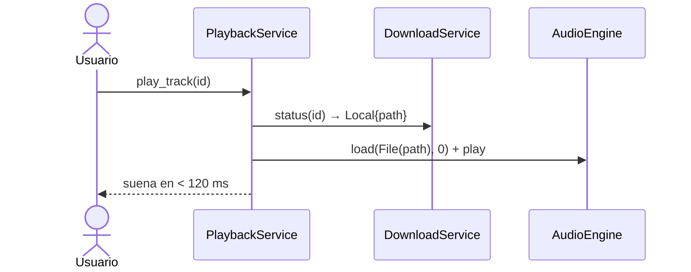
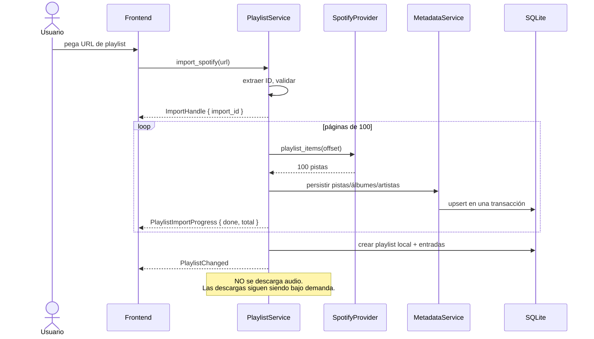
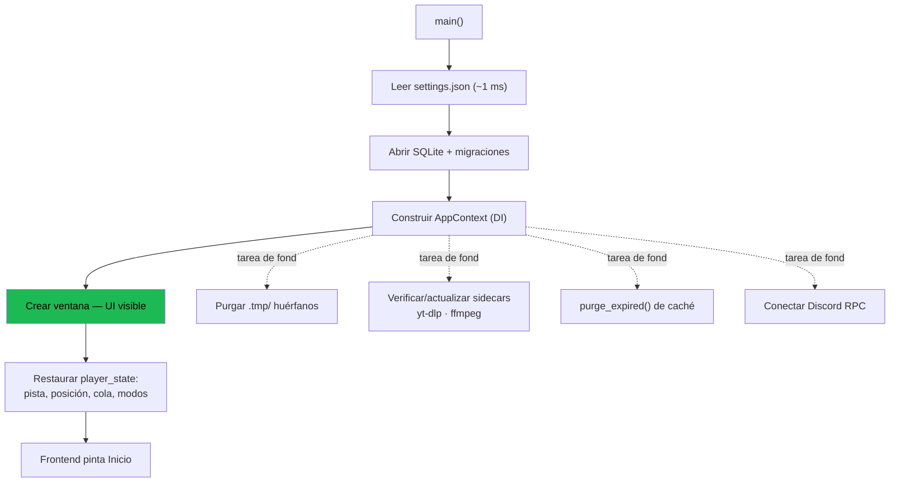
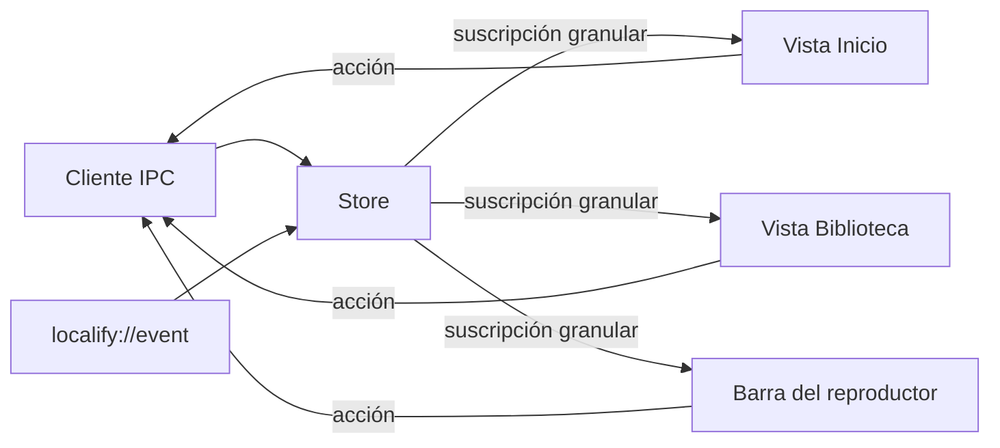

# 03 — Comunicación entre módulos

Tres mecanismos, cada uno con un propósito exclusivo. No se mezclan.

| Mecanismo | Dirección | Uso | Latencia |
|---|---|---|---|
| **Comandos Tauri** | Frontend → Backend | Petición/respuesta con resultado | ~0.2 ms + trabajo |
| **Bus de eventos** | Backend → Frontend + consumidores internos | Notificar hechos consumados | asíncrono |
| **Llamadas por trait** | Servicio → Servicio | Composición de lógica | directa |
| **Canales (`mpsc`/`watch`/lock-free)** | Hacia actores y hacia el hilo de audio | Estado con concurrencia | µs |

**Regla dura:** un servicio nunca invoca un comando Tauri, y el frontend nunca
recibe una llamada directa. La única puerta es `localify-app`.

---

## 1. Frontend → Backend: comandos

```ts
// frontend/src/ipc/client.ts  — capa única y tipada; ningún módulo llama a invoke() directamente
const tracks = await api.library.tracks({ filter: { favorite: true }, page: { offset: 0, limit: 100 } });
```

```rust
#[tauri::command]
async fn library_tracks(
    ctx: State<'_, AppContext>,
    filter: TrackFilterDto,
    sort: TrackSortDto,
    page: PageDto,
) -> Result<PageDto<TrackRowDto>, ApiError> {
    ctx.library.tracks(filter.into(), sort.into(), page.into())
       .await
       .map(Into::into)
       .map_err(ApiError::from)
}
```

El handler de comando es **siempre trivial**: convierte DTO → dominio, delega
en un trait, convierte dominio → DTO, mapea el error. Si un handler contiene un
`if` de negocio, está mal ubicado y debe bajar a un servicio.

---

## 2. Backend → Frontend: eventos

```rust
// core/src/events.rs
#[derive(Clone, Serialize)]
#[serde(tag = "type", rename_all = "camelCase")]
pub enum DomainEvent {
    TrackChanged { track_id: TrackId, source: ChangeSource },
    PlayStatusChanged { status: PlayStatus },
    QueueChanged { revision: u64 },
    DownloadStarted { track_id: TrackId },
    DownloadPlayable { track_id: TrackId },
    DownloadProgress { track_id: TrackId, percent: f32, bytes: u64 },
    DownloadCompleted { track_id: TrackId },
    DownloadFailed { track_id: TrackId, reason_key: String },
    AvailabilityChanged { track_id: TrackId, availability: AvailabilityDto },
    LibraryChanged { scope: LibraryScope },
    PlaylistChanged { playlist_id: PlaylistId, kind: PlaylistChangeKind },
    PlaylistImportProgress { import_id: Uuid, done: u32, total: u32 },
    SearchRemoteReady { query_id: u64 },
    SettingsChanged { sections: Vec<SettingsSection> },
    ProviderStatusChanged { provider: &'static str, status: ProviderStatusDto },
}
```

El puente vive en `localify-app` y es lo único que conoce a la vez el bus y a
Tauri:

```rust
fn spawn_event_bridge(app: AppHandle, mut rx: broadcast::Receiver<DomainEvent>) {
    tauri::async_runtime::spawn(async move {
        loop {
            match rx.recv().await {
                Ok(ev) => { let _ = app.emit("localify://event", &ev); }
                Err(RecvError::Lagged(n)) => {
                    warn!(skipped = n, "consumidor lento; forzando resincronización");
                    let _ = app.emit("localify://resync", ());   // el frontend recarga su estado
                }
                Err(RecvError::Closed) => break,
            }
        }
    });
}
```

**Por qué `Lagged` importa.** `broadcast` descarta mensajes si el receptor no
sigue el ritmo. En vez de ignorarlo, se convierte en una señal de
resincronización: el frontend vuelve a pedir el estado completo. Así la UI
nunca queda desincronizada de forma silenciosa. Este es el motivo por el que
los eventos llevan IDs y no estado completo: el evento es una pista, la verdad
está en la base de datos.

### Eventos de alta frecuencia: no van por el bus

`position_ms` cambia 44 100 veces por segundo. Emitirlo por IPC es absurdo. El
frontend hace `requestAnimationFrame` con throttle a 4 Hz y llama a
`player_position()`, un comando que lee un `AtomicU64` y responde en
microsegundos. El progreso de descarga se throttlea a 2 Hz por job en el propio
servicio, antes de publicar.

---

## 3. Servicio → Actor

```rust
// Handle público: barato de clonar, es lo que se inyecta como Arc<dyn PlaybackService>
#[derive(Clone)]
pub struct PlaybackHandle { tx: mpsc::Sender<PlaybackCommand> }

enum PlaybackCommand {
    Play { track: TrackId, ctx: PlaybackContext, reply: oneshot::Sender<Result<(), CoreError>> },
    Seek { ms: u32, reply: oneshot::Sender<Result<(), CoreError>> },
    // ...
}

#[async_trait]
impl PlaybackService for PlaybackHandle {
    async fn seek(&self, ms: u32) -> Result<(), CoreError> {
        let (reply, rx) = oneshot::channel();
        self.tx.send(PlaybackCommand::Seek { ms, reply }).await
            .map_err(|_| CoreError::Internal("actor de reproducción caído".into()))?;
        rx.await.map_err(|_| CoreError::Internal("actor no respondió".into()))?
    }
}
```

El bucle del actor es un `select!` sobre: comandos entrantes, eventos del motor
de audio, tick de persistencia (5 s) y cambios de ajustes (`watch`). Nada más
puede tocar su estado.

**Reentrada.** El actor nunca llama a un servicio que pueda volver a llamarle
(deadlock). Las operaciones potencialmente largas (esperar `DownloadPlayable`)
se hacen en una tarea hija que devuelve el resultado al actor por su propio
canal; el bucle no se bloquea nunca.

---

## 4. Flujo completo: buscar y reproducir una canción nueva

Es el flujo que define el producto. Todo lo demás son variaciones.

```mermaid
sequenceDiagram
    autonumber
    actor U as Usuario
    participant FE as Frontend
    participant SS as SearchService
    participant DB as SQLite
    participant SP as SpotifyProvider
    participant PS as PlaybackService
    participant DS as DownloadService
    participant YM as YoutubeMatcher
    participant YT as yt-dlp
    participant AE as AudioEngine

    U->>FE: teclea "bohemian rhapsody"
    FE->>SS: search(q) [cada pulsación]
    SS->>DB: FTS5 MATCH
    DB-->>SS: 0 resultados
    SS-->>FE: { local: [], remote: Loading }
    Note over FE: pinta "buscando…" sin bloquear

    SS->>SP: search_tracks(q) [debounce 180 ms]
    SP-->>SS: 20 pistas
    SS->>DB: upsert metadatos (transacción)
    SS-->>FE: evento SearchRemoteReady { query_id }
    FE->>SS: search(q) → ahora con resultados
    FE-->>U: lista pintada

    U->>FE: click en la pista
    FE->>PS: play_track(id, ctx=SearchResults)
    PS->>DS: status(id) → Absent
    PS-->>FE: PlayStatusChanged(Buffering)
    PS->>DS: ensure(id, Immediate)

    DS->>YM: find_best(track)
    YM->>YT: ytsearch por ISRC / YouTube Music / artista+título
    YT-->>YM: candidatos con metadatos
    YM->>YM: puntuar (duración · fuente · texto − penalizaciones)
    YM-->>DS: video_id, score 91, High

    DS->>YT: descargar bestaudio → .tmp/{id}.webm.part
    YT-->>DS: progreso por stdout JSON
    DS-->>PS: DownloadPlayable (≈300 KB)
    PS->>AE: load(Growing{ .part }), play
    AE-->>PS: EngineEvent::Started
    PS-->>FE: TrackChanged + PlayStatusChanged(Playing)
    FE-->>U: 🎵 suena  (t ≈ 2–3 s desde el click)

    Note over PS: en paralelo, prefetch de las 2 siguientes

    YT-->>DS: 100 %
    DS->>DS: verificar (demux íntegro + duración ±2 s)
    DS->>DS: escribir tags + portada
    DS->>DS: fsync + rename atómico → audio/bo/{id}.webm
    DS->>DB: INSERT audio_files
    DS-->>FE: DownloadCompleted + AvailabilityChanged
    Note over AE: el motor sigue leyendo el descriptor abierto;<br/>el rename en Windows se hace con MOVEFILE_REPLACE_EXISTING<br/>tras confirmar que no hay lectores, o se difiere al fin de la pista
```

### Punto delicado: renombrar un archivo que se está reproduciendo

En Windows, renombrar un fichero con un handle abierto falla salvo que se abra
con `FILE_SHARE_DELETE`. Dos medidas, ambas necesarias:

1. `GrowingFileSource` abre siempre con `FILE_SHARE_READ | FILE_SHARE_WRITE |
   FILE_SHARE_DELETE` (vía `std::os::windows::fs::OpenOptionsExt::share_mode`).
   Con eso, el rename funciona y el handle abierto sigue siendo válido.
2. Si aun así falla, la finalización se **difiere**: el job queda en estado
   `PendingFinalize` y se completa cuando el motor cierre la voz. La pista no
   se registra en `audio_files` hasta que el fichero definitivo existe. En
   ningún escenario se registra una ruta que no exista.

---

## 5. Flujo: reproducir algo que ya está local



Sin red, sin Spotify, sin yt-dlp. **Una canción ya descargada nunca vuelve a
descargarse** — invariante del prompt, garantizada porque `ensure()` consulta
`audio_files` antes que cualquier otra cosa.

---

## 6. Flujo: importar una playlist pública de Spotify



---

## 7. Flujo: crossfade entre pistas

```mermaid
sequenceDiagram
    participant AE as AudioEngine
    participant PS as PlaybackService
    participant QS as QueueService
    participant DS as DownloadService

    Note over AE: quedan crossfade_ms + 2 s para el final
    AE-->>PS: EngineEvent::ApproachingEnd
    PS->>QS: peek_next()
    QS-->>PS: track_id siguiente
    PS->>DS: status(next)
    alt disponible (local o .part reproducible)
        PS->>AE: load(next) en la voz libre → VoiceId(1)
        Note over AE: quedan crossfade_ms
        PS->>AE: crossfade_to(VoiceId(1), crossfade_ms)
        AE->>AE: rampas equal-power en el mezclador
        AE-->>PS: EngineEvent::VoiceEnded(VoiceId(0))
        PS->>QS: advance(NaturalEnd)
        PS-->>PS: emitir TrackChanged
    else no disponible aún
        Note over PS: sin crossfade; se espera al final real<br/>y se entra en Buffering. Nunca se corta la pista actual.
    end
```

El crossfade es una decisión del `PlaybackService` (política) ejecutada por el
`AudioEngine` (mecanismo). El motor no sabe qué es una cola.

---

## 8. Flujo: arranque de la aplicación

Optimizado para "UI interactiva lo antes posible". Nada bloquea la ventana.



La pista restaurada **no se reproduce** al arrancar (Spotify tampoco lo hace):
se deja cargada y pausada en la posición exacta. Pulsar play continúa donde se
quedó, al segundo.

---

## 9. Frontend: flujo de datos interno



El store es ~150 líneas: un `Map<string, Set<Listener>>` con slices
independientes (`player`, `queue`, `library`, `settings`). Cada vista se
suscribe solo a los slices que usa. **No hay lógica de negocio en el store**:
recibe estado del backend y lo reparte.

Renderizado: DOM directo con plantillas `<template>` y reciclado de nodos en
las listas virtualizadas. Sin virtual DOM: para una app de listas y una barra
de reproducción, el diff genérico es coste puro.

---

## 10. Reglas de comunicación (resumen normativo)

1. El frontend solo habla por `invoke` y solo escucha `localify://event`.
2. Ningún handler de comando contiene lógica de negocio.
3. Un servicio depende de otros **solo por trait**, inyectado en el constructor.
4. El estado mutable compartido se posee en un actor, no en un `Mutex`.
5. Los eventos describen hechos pasados y llevan IDs, no estado completo.
6. Perder un evento nunca corrompe la UI: siempre hay un comando para
   resincronizar.
7. El hilo de audio solo se comunica por estructuras lock-free.
8. Toda operación > 50 ms es asíncrona y reporta progreso por eventos.
