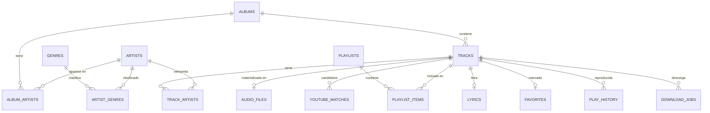

# 05 — Diseño de la base de datos

SQLite embebido (`rusqlite` con `bundled`, FTS5 activado). Un único fichero
`localify.db` en la carpeta de configuración, en modo WAL.

**Principio rector:** el identificador de una pista lo emite el catálogo del que
sale (YouTube Music o Spotify), y no hay proveedor privilegiado: el usuario elige
cuál usar y los dos pueden convivir en la misma base de datos.

Esto reemplaza al principio original ("el ID de Spotify es el identificador
principal; el de YouTube nunca es clave de dominio"), escrito cuando Spotify era
el único origen posible. Con YouTube Music como origen, el `videoId` **es** la
identidad de la pista: mantener el otro obligaría a inventar un ID de Spotify
para contenido que no está en Spotify. Las formas admitidas están en un solo
sitio, `domain::ids::tiene_forma_de_id`.

---

## 1. Configuración de la conexión

```sql
PRAGMA journal_mode = WAL;        -- lectores concurrentes sin bloquear al escritor
PRAGMA synchronous = NORMAL;      -- seguro en WAL; evita un fsync por transacción
PRAGMA foreign_keys = ON;         -- integridad referencial real
PRAGMA busy_timeout = 5000;
PRAGMA temp_store = MEMORY;
PRAGMA cache_size = -16000;       -- 16 MB de caché de páginas
PRAGMA mmap_size = 268435456;     -- 256 MB de I/O mapeado en memoria
PRAGMA auto_vacuum = INCREMENTAL; -- se recupera espacio sin VACUUM completo
```

`synchronous = FULL` costaría ~10 ms por escritura y no aporta: en WAL,
`NORMAL` solo arriesga las últimas transacciones ante un corte de corriente, y
lo que perderíamos sería una posición de reproducción, no la biblioteca (los
ficheros de audio están en disco con sus tags).

---

## 2. Diagrama entidad-relación



---

## 3. Esquema

### V1 — Núcleo del catálogo

```sql
-- ─── ARTISTAS ────────────────────────────────────────────────────────────────
CREATE TABLE artists (
    id            TEXT PRIMARY KEY,          -- ID de Spotify, o 'local:<uuid>'
    name          TEXT NOT NULL,
    name_norm     TEXT NOT NULL,             -- normalización canónica (core::text)
    image_url     TEXT,
    popularity    INTEGER,
    followers     INTEGER,
    metadata_at   INTEGER,                   -- unix s; NULL = solo referencia, sin detalle
    created_at    INTEGER NOT NULL DEFAULT (unixepoch())
) STRICT;

CREATE INDEX idx_artists_name_norm ON artists(name_norm);

-- ─── ÁLBUMES ─────────────────────────────────────────────────────────────────
CREATE TABLE albums (
    id            TEXT PRIMARY KEY,
    title         TEXT NOT NULL,
    title_norm    TEXT NOT NULL,
    album_type    TEXT NOT NULL DEFAULT 'album'   -- album | single | compilation
                  CHECK (album_type IN ('album','single','compilation')),
    release_date  TEXT,                       -- ISO-8601, precisión variable
    total_tracks  INTEGER,
    cover_url     TEXT,                       -- origen remoto
    cover_cached  INTEGER NOT NULL DEFAULT 0, -- 0/1: ya está en covers/
    label         TEXT,
    metadata_at   INTEGER,
    created_at    INTEGER NOT NULL DEFAULT (unixepoch())
) STRICT;

CREATE INDEX idx_albums_title_norm ON albums(title_norm);

-- ─── PISTAS ──────────────────────────────────────────────────────────────────
-- id = ID de Spotify. Para pistas sin equivalente: 'local:<uuid-v7>'.
CREATE TABLE tracks (
    id            TEXT PRIMARY KEY,
    title         TEXT NOT NULL,
    title_norm    TEXT NOT NULL,
    album_id      TEXT REFERENCES albums(id) ON DELETE SET NULL,
    duration_ms   INTEGER NOT NULL CHECK (duration_ms > 0),
    track_number  INTEGER,
    disc_number   INTEGER DEFAULT 1,
    explicit      INTEGER NOT NULL DEFAULT 0,
    isrc          TEXT,                       -- clave de oro para el matching
    popularity    INTEGER,
    -- denormalización deliberada: evita un JOIN en TODA lista de pistas
    artist_display TEXT NOT NULL DEFAULT '',  -- "Queen, David Bowie"
    artist_norm    TEXT NOT NULL DEFAULT '',
    metadata_at   INTEGER,
    added_at      INTEGER NOT NULL DEFAULT (unixepoch())
) STRICT;

CREATE INDEX idx_tracks_album    ON tracks(album_id, disc_number, track_number);
CREATE INDEX idx_tracks_added    ON tracks(added_at DESC);
CREATE INDEX idx_tracks_isrc     ON tracks(isrc) WHERE isrc IS NOT NULL;
CREATE INDEX idx_tracks_title_n  ON tracks(title_norm);

-- ─── RELACIONES N:M ──────────────────────────────────────────────────────────
CREATE TABLE track_artists (
    track_id   TEXT NOT NULL REFERENCES tracks(id)  ON DELETE CASCADE,
    artist_id  TEXT NOT NULL REFERENCES artists(id) ON DELETE CASCADE,
    position   INTEGER NOT NULL,               -- 0 = artista principal
    PRIMARY KEY (track_id, artist_id)
) STRICT;
CREATE INDEX idx_track_artists_artist ON track_artists(artist_id);

CREATE TABLE album_artists (
    album_id   TEXT NOT NULL REFERENCES albums(id)  ON DELETE CASCADE,
    artist_id  TEXT NOT NULL REFERENCES artists(id) ON DELETE CASCADE,
    position   INTEGER NOT NULL,
    PRIMARY KEY (album_id, artist_id)
) STRICT;
CREATE INDEX idx_album_artists_artist ON album_artists(artist_id);

CREATE TABLE genres (
    id    INTEGER PRIMARY KEY,
    name  TEXT NOT NULL UNIQUE
) STRICT;

CREATE TABLE artist_genres (
    artist_id TEXT    NOT NULL REFERENCES artists(id) ON DELETE CASCADE,
    genre_id  INTEGER NOT NULL REFERENCES genres(id)  ON DELETE CASCADE,
    PRIMARY KEY (artist_id, genre_id)
) STRICT;
CREATE INDEX idx_artist_genres_genre ON artist_genres(genre_id);
```

**Sobre `artist_display`.** Es una denormalización consciente. Sin ella, cada
fila de una lista de 50 000 pistas necesita un `JOIN` + `GROUP_CONCAT` sobre
`track_artists`. Con ella, la consulta de lista es un `SELECT` plano sobre una
sola tabla. Se recalcula en la misma transacción en la que se escriben los
artistas; no puede desincronizarse porque solo hay un camino de escritura
(`MetadataService`).

`STRICT` (SQLite ≥ 3.37) obliga a que los tipos de columna se respeten. Es
gratis y elimina una clase entera de bugs.

---

### V1 — Materialización local

```sql
-- Un archivo de audio realmente presente en disco. Su existencia es la
-- definición de "la pista está en mi biblioteca".
CREATE TABLE audio_files (
    track_id     TEXT PRIMARY KEY REFERENCES tracks(id) ON DELETE CASCADE,
    rel_path     TEXT NOT NULL UNIQUE,       -- RELATIVA a la raíz de biblioteca
    format       TEXT NOT NULL,              -- opus | m4a | mp3 | flac | ogg | wav
    codec        TEXT NOT NULL,
    bitrate_kbps INTEGER,
    sample_rate  INTEGER,
    channels     INTEGER,
    size_bytes   INTEGER NOT NULL,
    duration_ms  INTEGER NOT NULL,           -- duración REAL medida, no la de Spotify
    source       TEXT NOT NULL DEFAULT 'youtube'
                 CHECK (source IN ('youtube','imported')),
    youtube_id   TEXT,                       -- procedencia, informativo
    verified_at  INTEGER NOT NULL,
    created_at   INTEGER NOT NULL DEFAULT (unixepoch())
) STRICT;

CREATE INDEX idx_audio_files_created ON audio_files(created_at DESC);
```

`rel_path` es **relativa**: cambiar la carpeta de biblioteca no obliga a
reescribir 50 000 filas, y hace la base de datos portable entre máquinas.

`duration_ms` aquí es la duración real del fichero; la de `tracks` es la de
Spotify. La diferencia entre ambas es la señal de verificación tras descargar.

---

### V1 — Descargas y matching

```sql
-- Caché de la decisión del matcher. Borrarla solo cuesta tiempo, nunca datos.
CREATE TABLE youtube_matches (
    id          INTEGER PRIMARY KEY,
    track_id    TEXT NOT NULL REFERENCES tracks(id) ON DELETE CASCADE,
    video_id    TEXT NOT NULL,
    title       TEXT NOT NULL,
    channel     TEXT,
    duration_s  INTEGER,
    score       REAL NOT NULL,
    confidence  TEXT NOT NULL CHECK (confidence IN ('high','medium','low')),
    breakdown   TEXT NOT NULL,               -- JSON: por qué ganó — trazabilidad
    rejected    INTEGER NOT NULL DEFAULT 0,  -- el usuario lo marcó como incorrecto
    created_at  INTEGER NOT NULL DEFAULT (unixepoch()),
    UNIQUE (track_id, video_id)
) STRICT;

CREATE INDEX idx_ytm_track ON youtube_matches(track_id, rejected, score DESC);

-- Estado de descarga persistido: sobrevive a un cierre inesperado.
CREATE TABLE download_jobs (
    track_id     TEXT PRIMARY KEY REFERENCES tracks(id) ON DELETE CASCADE,
    state        TEXT NOT NULL
                 CHECK (state IN ('queued','matching','downloading','finalizing','done','failed')),
    priority     TEXT NOT NULL DEFAULT 'prefetch' CHECK (priority IN ('immediate','prefetch')),
    video_id     TEXT,
    tmp_path     TEXT,
    bytes_done   INTEGER NOT NULL DEFAULT 0,
    bytes_total  INTEGER,
    attempts     INTEGER NOT NULL DEFAULT 0,
    last_error   TEXT,                       -- clave i18n + parámetros (JSON)
    started_at   INTEGER,
    updated_at   INTEGER NOT NULL DEFAULT (unixepoch())
) STRICT;

CREATE INDEX idx_dl_state ON download_jobs(state, priority, updated_at);
```

Al arrancar, todo job en `downloading`/`finalizing` se reencola como `queued` y
su `.part` se descarta. No se reanudan descargas parciales: yt-dlp reanuda por
su cuenta si el fragmento sigue siendo válido, y arriesgar un fichero mal
concatenado violaría "nunca dejar archivos corruptos".

---

### V1 — Colección del usuario

```sql
CREATE TABLE favorites (
    track_id  TEXT PRIMARY KEY REFERENCES tracks(id) ON DELETE CASCADE,
    added_at  INTEGER NOT NULL DEFAULT (unixepoch())
) STRICT;
CREATE INDEX idx_favorites_added ON favorites(added_at DESC);

CREATE TABLE playlists (
    id          TEXT PRIMARY KEY,             -- uuid-v7: ordenable por tiempo
    name        TEXT NOT NULL,
    name_norm   TEXT NOT NULL,
    description TEXT,
    cover_path  TEXT,                         -- portada propia; si NULL → mosaico 2×2
    source      TEXT NOT NULL DEFAULT 'local'
                CHECK (source IN ('local','spotify_import')),
    source_id   TEXT,                         -- ID de la playlist de Spotify importada
    created_at  INTEGER NOT NULL DEFAULT (unixepoch()),
    updated_at  INTEGER NOT NULL DEFAULT (unixepoch())
) STRICT;

CREATE TABLE playlist_items (
    id          TEXT PRIMARY KEY,             -- uuid: identidad estable de la ENTRADA
    playlist_id TEXT NOT NULL REFERENCES playlists(id) ON DELETE CASCADE,
    track_id    TEXT NOT NULL REFERENCES tracks(id)    ON DELETE CASCADE,
    position    REAL NOT NULL,                -- clave fraccionaria → reordenar = 1 UPDATE
    added_at    INTEGER NOT NULL DEFAULT (unixepoch())
) STRICT;

CREATE INDEX idx_pli_playlist ON playlist_items(playlist_id, position);
CREATE INDEX idx_pli_track    ON playlist_items(track_id);
```

La entrada de playlist tiene **ID propio** porque una misma pista puede
aparecer dos veces en la misma playlist (Spotify lo permite) y "elimina esta
fila" tiene que ser inequívoco.

**`position REAL`:** insertar entre A (2.0) y B (3.0) da 2.5. Un `UPDATE` de
una fila en lugar de N. Un rebalanceo en segundo plano renumera a enteros
cuando la separación mínima baja de `1e-6`.

```sql
CREATE TABLE play_history (
    id          INTEGER PRIMARY KEY,
    track_id    TEXT NOT NULL REFERENCES tracks(id) ON DELETE CASCADE,
    played_at   INTEGER NOT NULL DEFAULT (unixepoch()),
    ms_played   INTEGER NOT NULL,
    completed   INTEGER NOT NULL DEFAULT 0,   -- ≥ 90 % reproducido
    context     TEXT                          -- 'album:xx' | 'playlist:yy' | 'search' | 'recommendation'
) STRICT;

CREATE INDEX idx_history_track  ON play_history(track_id, played_at DESC);
CREATE INDEX idx_history_recent ON play_history(played_at DESC);
```

El historial es la materia prima de las recomendaciones locales. `completed`
distingue "me gusta" de "la salté a los 10 segundos": una señal negativa vale
tanto como una positiva.

---

### V1 — Sistema

```sql
CREATE TABLE settings (
    key        TEXT PRIMARY KEY,
    value      TEXT NOT NULL,                 -- JSON
    updated_at INTEGER NOT NULL DEFAULT (unixepoch())
) STRICT;

CREATE TABLE cache_entries (
    namespace  TEXT NOT NULL,
    key        TEXT NOT NULL,
    value      BLOB NOT NULL,
    expires_at INTEGER NOT NULL,
    created_at INTEGER NOT NULL DEFAULT (unixepoch()),
    PRIMARY KEY (namespace, key)
) STRICT;
CREATE INDEX idx_cache_expiry ON cache_entries(expires_at);

CREATE TABLE lyrics (
    track_id    TEXT PRIMARY KEY REFERENCES tracks(id) ON DELETE CASCADE,
    synced      TEXT,                          -- JSON [{at_ms, text}]
    plain       TEXT,
    source      TEXT,
    not_found   INTEGER NOT NULL DEFAULT 0,   -- caché negativa: no reintentar en 30 días
    fetched_at  INTEGER NOT NULL DEFAULT (unixepoch())
) STRICT;

```

---

### V3 — Estado del reproductor

```sql
-- Fila única (id = 1). Restaura la sesión exactamente donde se dejó.
CREATE TABLE player_state (
    id             INTEGER PRIMARY KEY CHECK (id = 1),
    track_id       TEXT REFERENCES tracks(id) ON DELETE SET NULL,
    position_ms    INTEGER NOT NULL DEFAULT 0,
    volume         REAL    NOT NULL DEFAULT 1.0,
    repeat_mode    TEXT    NOT NULL DEFAULT 'off' CHECK (repeat_mode IN ('off','queue','track')),
    shuffle        INTEGER NOT NULL DEFAULT 0,
    shuffle_seed   INTEGER,                   -- reproduce la MISMA permutación tras reiniciar
    context        TEXT,                      -- JSON: PlaybackContext
    context_queue  TEXT,                      -- JSON: [TrackId] en orden efectivo
    user_queue     TEXT,                      -- JSON: [QueueEntry]
    queue_index    INTEGER NOT NULL DEFAULT 0,
    updated_at     INTEGER NOT NULL DEFAULT (unixepoch())
) STRICT;

INSERT INTO player_state (id) VALUES (1);
```

Guardar la cola como JSON en una fila, en lugar de una tabla `queue_items`, es
deliberado: se escribe y se lee **siempre entera**, nunca se consulta por
partes, y se actualiza con frecuencia. Una tabla normalizada aquí solo añadiría
escrituras. La normalización sirve para consultar; esto no se consulta.

---

### V2 — Búsqueda de texto completo

```sql
CREATE VIRTUAL TABLE tracks_fts USING fts5(
    title,
    artist,
    album,
    content    = '',            -- índice externo: no duplicamos el texto
    tokenize   = "unicode61 remove_diacritics 2",
    prefix     = '2 3'          -- búsqueda por prefijo de 2 y 3 chars: instantánea al teclear
);
```

`content=''` mantiene el índice pequeño: FTS5 guarda solo el índice invertido y
nosotros resolvemos los datos con un `JOIN` por `rowid`. Para 50 000 pistas el
índice ronda los pocos MB.

Sincronización por triggers, de modo que **es imposible** que el índice se
desincronice del catálogo:

```sql
CREATE TRIGGER tracks_fts_ai AFTER INSERT ON tracks BEGIN
    INSERT INTO tracks_fts(rowid, title, artist, album)
    VALUES (new.rowid, new.title, new.artist_display,
            COALESCE((SELECT title FROM albums WHERE id = new.album_id), ''));
END;

CREATE TRIGGER tracks_fts_ad AFTER DELETE ON tracks BEGIN
    INSERT INTO tracks_fts(tracks_fts, rowid, title, artist, album)
    VALUES ('delete', old.rowid, old.title, old.artist_display, '');
END;

CREATE TRIGGER tracks_fts_au AFTER UPDATE OF title, artist_display, album_id ON tracks BEGIN
    INSERT INTO tracks_fts(tracks_fts, rowid, title, artist, album)
    VALUES ('delete', old.rowid, old.title, old.artist_display, '');
    INSERT INTO tracks_fts(rowid, title, artist, album)
    VALUES (new.rowid, new.title, new.artist_display,
            COALESCE((SELECT title FROM albums WHERE id = new.album_id), ''));
END;
```

Consulta de búsqueda instantánea, con las pistas ya descargadas primero:

```sql
SELECT t.id, t.title, t.artist_display, t.duration_ms,
       a.title AS album_title, a.id AS album_id,
       (af.track_id IS NOT NULL) AS is_local,
       (f.track_id  IS NOT NULL) AS is_favorite
FROM tracks_fts fts
JOIN tracks      t  ON t.rowid    = fts.rowid
LEFT JOIN albums a  ON a.id       = t.album_id
LEFT JOIN audio_files af ON af.track_id = t.id
LEFT JOIN favorites   f  ON f.track_id  = t.id
WHERE tracks_fts MATCH ?1
ORDER BY is_local DESC, bm25(tracks_fts, 10.0, 8.0, 3.0)
LIMIT ?2 OFFSET ?3;
```

Los pesos de `bm25` (título 10, artista 8, álbum 3) reflejan que buscar por
título es lo más común. `is_local DESC` implementa "local primero" a nivel de
SQL, no de aplicación.

---

## 4. Consultas de referencia

**Lista de biblioteca con keyset pagination** — coste constante en la página
40 000, a diferencia de `OFFSET`:

```sql
SELECT t.id, t.title, t.artist_display, t.duration_ms, a.id AS album_id,
       (af.track_id IS NOT NULL) AS is_local
FROM tracks t
JOIN audio_files af ON af.track_id = t.id          -- solo lo descargado
LEFT JOIN albums a  ON a.id = t.album_id
WHERE (t.added_at, t.id) < (?1, ?2)                -- cursor
ORDER BY t.added_at DESC, t.id DESC
LIMIT 100;
```

**Similitud para recomendaciones** (artistas compartidos + co-ocurrencia en
playlists), toda la lógica en SQL:

```sql
WITH seed_artists AS (
    SELECT artist_id FROM track_artists WHERE track_id = ?1
),
by_artist AS (
    SELECT ta.track_id, 0.45 AS w
    FROM track_artists ta
    JOIN seed_artists s ON s.artist_id = ta.artist_id
    WHERE ta.track_id <> ?1
),
by_genre AS (
    SELECT DISTINCT ta.track_id, 0.25 AS w
    FROM artist_genres ag
    JOIN artist_genres ag2 ON ag2.genre_id = ag.genre_id
    JOIN track_artists ta  ON ta.artist_id = ag2.artist_id
    WHERE ag.artist_id IN (SELECT artist_id FROM seed_artists)
      AND ta.track_id <> ?1
),
by_playlist AS (
    SELECT pi2.track_id, 0.15 AS w
    FROM playlist_items pi1
    JOIN playlist_items pi2 ON pi2.playlist_id = pi1.playlist_id
    WHERE pi1.track_id = ?1 AND pi2.track_id <> ?1
)
SELECT track_id, SUM(w) AS score
FROM (SELECT * FROM by_artist UNION ALL
      SELECT * FROM by_genre  UNION ALL
      SELECT * FROM by_playlist)
GROUP BY track_id
ORDER BY score DESC
LIMIT ?2;
```

---

## 5. Migraciones

`refinery` con SQL embebido en el binario. Nomenclatura `V{n}__{descripción}.sql`.

Reglas:
1. Una migración aplicada **nunca** se edita. Los errores se corrigen con una
   migración nueva.
2. Toda migración se ejecuta dentro de una transacción.
3. Antes de aplicar migraciones, se copia `localify.db` a
   `localify.db.bak.v{n}` (se conservan las 2 últimas).
4. Si una migración falla, la app arranca **sin biblioteca**: la ventana se abre
   y cada operación devuelve el error, que la UI enseña. No se cierra y no se
   sustituye el catálogo por datos de ejemplo.
5. Sin migraciones hacia atrás: instalar una versión anterior sobre una base de
   datos más nueva se detecta por `user_version` y se avisa.

**Plan inicial**

| Versión | Contenido |
|---|---|
| V1 | Catálogo, materialización local, descargas, colección, sistema |
| V2 | `tracks_fts` + triggers |
| V3 | `player_state` |

---

## 6. Mantenimiento

Tareas en segundo plano, nunca en el arranque bloqueante:

| Tarea | Cadencia | Acción |
|---|---|---|
| `purge_expired` | al arrancar + cada 6 h | borra `cache_entries` caducadas |
| `PRAGMA incremental_vacuum` | semanal | recupera páginas libres sin bloquear |
| `PRAGMA optimize` | al cerrar | actualiza estadísticas del planificador |
| `wal_checkpoint(TRUNCATE)` | cuando el WAL > 64 MB | evita que crezca sin límite |
| `rescan` | manual | reconcilia disco ↔ base de datos |
| Huérfanos | diario | `tracks` sin audio, sin playlist, sin favorito, sin historial y con > 30 días → se borran |

---

## 7. Estimación de tamaño

Para una biblioteca de 10 000 pistas / 1 500 álbumes / 3 000 artistas:

| Tabla | Filas | Tamaño aprox. |
|---|---|---|
| tracks | 10 000 | 3.0 MB |
| albums | 1 500 | 0.4 MB |
| artists | 3 000 | 0.5 MB |
| track_artists | 18 000 | 0.9 MB |
| audio_files | 10 000 | 1.2 MB |
| youtube_matches | 25 000 | 4.5 MB |
| play_history | 50 000 | 2.5 MB |
| tracks_fts | — | 2.5 MB |
| **Total** | | **≈ 16 MB** |

Despreciable frente a los ~40 GB de audio. La base de datos cabe entera en la
caché de páginas del SO, que es exactamente el objetivo de rendimiento.
