# 07 — Roadmap

13 fases. Cada una declara **objetivos**, **dependencias**, **entregables** y
**criterios de finalización** verificables.

**Regla:** no se avanza a la fase N+1 hasta que todos los criterios de la fase N
se cumplen y están comprobados. Los criterios son binarios: se cumplen o no.
Nada de "casi".

```mermaid
gantt
    dateFormat X
    axisFormat %s
    section Fundamentos
    F1 Arquitectura        :done, f1, 0, 1
    F2 Base del proyecto   :f2, after f1, 1
    F3 Base de datos       :f3, after f2, 1
    F4 API Tauri           :f4, after f3, 1
    section Datos y audio
    F5 Spotify             :f5, after f4, 1
    F6 yt-dlp + matching   :f6, after f5, 1
    F7 Reproductor         :f7, after f6, 2
    section Producto
    F8 Biblioteca          :f8, after f7, 1
    F9 Playlists           :f9, after f8, 1
    F10 Interfaz           :f10, after f9, 2
    F11 Configuración      :f11, after f10, 1
    section Cierre
    F12 Optimización       :f12, after f11, 1
    F13 Pruebas y release  :f13, after f12, 1
```

---

## Fase 1 — Arquitectura ✅

**Objetivos.** Diseñar el sistema completo antes de escribir código de
producción.

**Dependencias.** Ninguna.

**Entregables.** Los ocho documentos de `docs/architecture/`.

**Criterios de finalización.**
- [x] Todos los módulos identificados, con responsabilidad única y explícita.
- [x] Comunicación entre módulos definida y sin ciclos.
- [x] Estructura de carpetas completa.
- [x] Esquema SQLite con tablas, índices, triggers y migraciones.
- [x] Catálogo completo de comandos y eventos.
- [x] Roadmap con criterios verificables.
- [x] Decisiones técnicas con alternativas documentadas.

---

## Fase 2 — Base del proyecto ✅

**Objetivos.** Un esqueleto que compile, arranque, muestre una ventana y tenga
CI verde. Sin funcionalidad.

**Dependencias.** Fase 1. Solo requiere Rust estable y git, ambos ya
disponibles. **Node.js no es necesario** (ADR-019).

**Entregables.**
- Workspace de Cargo con los 9 crates y sus dependencias declaradas.
- `localify-core` con entidades, IDs, `CoreError`, `DomainEvent` y todos los
  traits de `ports` — **con firmas definitivas**. Esto congela el contrato
  antes de implementar nada.
- Frontend TypeScript transpilado por `build.rs` con oxc, servido como módulos
  ES nativos. Ventana Tauri v2 con tema oscuro.
- `tracing` configurado con rotación de logs.
- `localify-platform`: rutas de datos, instancia única, gestión de sidecars.
- `scripts/fetch-sidecars.ps1` que descarga yt-dlp y ffmpeg verificando hash.
- CI: `cargo fmt --check`, `cargo clippy -- -D warnings`, `cargo test`; job
  opcional y no bloqueante de `tsc --noEmit`.

**Criterios de finalización.**
- [x] `cargo build --workspace` compila sin avisos.
- [x] `cargo clippy --workspace --all-targets -- -D warnings` pasa.
- [x] `cargo fmt --all -- --check` pasa.
- [x] 91 tests en verde.
- [x] `build.rs` transpila el frontend y regenera solo lo que cambia.
- [x] La app arranca y muestra la ventana en 250 ms en caliente (debug).
      En frío son ~3.2 s por la inicialización de WebView2; se mide de nuevo
      sobre build de release en la Fase 12.
- [x] Los logs se escriben en `%APPDATA%/Localify/logs/`.
- [x] `localify-core` no depende de ningún otro crate del workspace
      (verificado en CI con `cargo tree`).
- [x] `localify-services` no depende de infraestructura (verificado en CI).
- [x] `unsafe` confinado a `localify-platform` y `localify-audio` (verificado
      en CI).
- [x] Compilar el proyecto entero no requiere Node.js.
- [ ] CI verde en GitHub Actions sobre `windows-latest` — pendiente del primer
      push; los tres jobs se han validado en local.

---

## Fase 3 — Base de datos ✅

**Objetivos.** Persistencia completa y probada, sin lógica de negocio encima.

**Dependencias.** Fase 2.

**Entregables.**
- Migraciones V1–V3 con `refinery`.
- Pool de lectura + escritor único, con PRAGMAs.
- Todos los repositorios de `localify-db/src/repositories/`.
- FTS5 con triggers y consulta de búsqueda con `bm25`.
- Keyset pagination en las consultas de lista.
- Mappers fila → dominio.
- Backup automático previo a migración; modo degradado ante fallo.

**Criterios de finalización.**
- [x] Migraciones aplicables sobre base de datos vacía y sobre una ya migrada.
- [x] 134 tests de la capa de datos, con base de datos temporal en WAL (la
      misma configuración que en producción, no `:memory:`).
- [x] Benchmark sobre 50 000 pistas, medido en `--release`:
      - inserción **5.0 s** (objetivo < 10 s)
      - búsqueda FTS5 **6.8 ms** (objetivo < 30 ms)
      - página de scroll **0.88 ms** (objetivo < 15 ms)
      - coste **constante con la profundidad**: 854 µs en la página 1 frente a
        877 µs en la 500
      - base de datos de 29.3 MB
- [x] Toda consulta caliente usa índice, verificado con `EXPLAIN QUERY PLAN` en
      un test, no por inspección visual.
- [x] Los triggers de FTS mantienen el índice sincronizado en insert, update y
      delete, incluido el renombrado y borrado de álbumes.
- [x] Ninguna llamada a SQLite ocurre en un hilo del runtime async: todo el
      acceso pasa por `Pool::leer`/`Pool::escribir`, que usan `spawn_blocking`.
- [x] Una transacción fallida revierte por completo y no se lleva el escritor.
- [ ] Restaurar un backup tras migración fallida deja la app operativa —
      el backup y el modo degradado están implementados y probados; la
      restauración asistida es parte de la interfaz de Ajustes (Fase 11).

---

## Fase 4 — API Tauri ✅

**Objetivos.** Cablear la capa de comandos con servicios en memoria (dobles),
de modo que el frontend pueda desarrollarse en paralelo desde ya.

**Dependencias.** Fase 3.

**Entregables.**
- Todos los DTOs con `ts-rs`; `scripts/gen-types.ps1` genera `types.gen.ts`.
- Todos los comandos de [`06-api.md`](06-api.md) registrados, delegando en
  implementaciones de servicio en memoria.
- `AppContext` con inyección de dependencias.
- Bus de eventos + puente a Tauri, incluido el manejo de `Lagged` → `resync`.
- `ApiError` con mapeo desde `CoreError`.
- Cliente IPC tipado en el frontend (`ipc/client.ts`), único punto con `invoke`.
- `capabilities/default.json` con permisos mínimos y CSP estricta.

**Criterios de finalización.**
- [x] 49 comandos registrados, cubriendo el catálogo de
      [`06-api.md`](06-api.md).
- [x] 41 tipos de TypeScript generados desde los DTOs de Rust.
- [x] `types.gen.ts` se versiona y la CI exige diff vacío
      (`scripts/gen-types.ps1 -Verificar`).
- [x] Ningún handler contiene lógica de negocio: todos son DTO → dominio →
      trait → DTO.
- [x] Un evento emitido desde Rust llega al WebView, verificado ejecutando la
      aplicación: `trackChanged` y `playStatusChanged` aparecen en la pantalla
      de arranque.
- [x] `Lagged` provoca `localify://resync` en lugar de desincronizar en
      silencio (test explícito en `bridge.rs`).
- [x] La app funciona de extremo a extremo con datos provisionales: consulta
      estadísticas, lista pistas y reproduce.
- [x] Ningún secreto cruza el puente (test que rastrea el string en el JSON).

**Nota sobre `withGlobalTauri`.** Sin npm no existe `@tauri-apps/api` como
módulo importable, así que la aplicación expone el puente en `window.__TAURI__`.
Es una consecuencia directa del [ADR-019](08-decisions.md) y no una concesión:
el WebView sigue sin permisos de sistema de ficheros, red ni shell.

---

## Fase 5 — Spotify ✅

**Objetivos.** Metadatos reales.

**Dependencias.** Fase 4.

**Entregables.**
- Cliente con client-credentials, refresco de token y cifrado del secret
  (DPAPI).
- Rate limiter, backoff con jitter, respeto de `Retry-After`, coalescencia de
  peticiones idénticas.
- Endpoints: search, tracks (batch 50), albums, album tracks, artists, top
  tracks, playlists públicas paginadas.
- Mapeo a dominio + normalización canónica de texto.
- `MetadataService`: `ensure_*`, caché de portadas en 3 tamaños, escritura de
  tags con `lofty`.
- `SearchService` con el flujo local → remoto.
- UI de credenciales en Ajustes + estado del proveedor.

**Criterios de finalización.**
- [x] Los resultados locales llegan en la misma respuesta; los remotos avisan
      por `searchRemoteReady` con el mismo `queryId` (test de integración).
- [x] Importar una playlist recorre todas sus páginas, informa del progreso por
      página y salta las entradas sin pista.
- [x] Sin credenciales, la aplicación arranca y funciona por completo sobre la
      biblioteca local; la búsqueda devuelve `Unavailable` con la clave
      `provider.not_configured`, que es accionable desde Ajustes.
- [x] Un 429 se maneja sin errores visibles: se respeta `Retry-After`, se
      bloquean las peticiones siguientes y se reintenta.
- [x] **Cero llamadas de red en la suite**: el transporte va tras un trait y los
      tests usan respuestas preparadas.
- [x] El `client_secret` no aparece en el `Debug` de las credenciales, ni en
      `SettingsDto`, ni en el error de un JSON ilegible (tres tests que rastrean
      el string).
- [x] 71 tests del cliente de Spotify + 10 de integración del flujo de búsqueda.
- [ ] Verificación con credenciales reales contra la API de Spotify — pendiente
      de que el usuario aporte un `client_id`/`client_secret`.

**Estado de la caché de portadas.** `ensure_cover` devuelve `None` de momento:
la descarga y el escalado llegan con la caché de imágenes de la Fase 10, que es
cuando la interfaz las necesita. Hasta entonces la interfaz usa el mosaico.

---

## Fase 6 — yt-dlp, matching y descargas ✅

**Objetivos.** Convertir metadatos en ficheros de audio, de forma invisible y
fiable.

**Dependencias.** Fase 5.

**Entregables.**
- Gestión del sidecar: localización y clasificación de errores (`ExtractorObsoleto`
  se distingue de `VideoNoDisponible`, porque uno se arregla actualizando el
  binario y el otro buscando otro candidato).
- Búsqueda de candidatos: ISRC, YouTube Music, `ytsearch`, canales Topic.
- Sistema de puntuación completo, con `rules.rs` como **tabla de datos**
  (ajustable sin recompilar la lógica) y `breakdown` trazable.
- `DownloadService` como actor con carriles `Immediate`/`Prefetch`.
- Descarga a `.part`, progreso por stdout JSON, evento `DownloadPlayable`.
- Verificación post-descarga, escritura de tags, rename atómico, registro en
  `audio_files`.
- Reintentos con backoff y clasificación de errores.
- Limpieza de `.tmp/` al arrancar.

**Criterios de finalización.**
- [x] Corpus de **50 canciones variadas** (pop, rock, clásica, electrónica,
      remixes legítimos, directos legítimos, japonés, coreano, alemán, francés,
      español, temas sin álbum, de 23 s a 23 min): **100 %** (50/50) de
      coincidencias correctas, anotadas a mano
      (`localify-ytdlp/tests/corpus_amplio.rs`).
- [x] Cero falsos positivos de tipo karaoke/cover/8D en ese corpus. Los
      candidatos contaminados llevan el prefijo `basura-` en su identificador,
      así que el test los detecta solo, sin depender de la lista de fallos.
- [x] Una canción que es legítimamente un directo o un remix **sí** encuentra
      su versión (3 casos: *Hotel California - Live*, *Wish You Were Here -
      Live*, *Ghosts 'n' Stuff - Nero Remix*).
- [x] Confianza `Low` nunca descarga: marca `Failed` sin tocar `audio/`
      (`sin_coincidencia_fiable_no_entra_nada_en_la_biblioteca`).
- [x] Matar el proceso a mitad de descarga no deja nada en `audio/`, y al
      reabrir la app `.tmp/` queda limpia — incluidos los `.part` **huérfanos**,
      los que quedaron sin fila porque el corte llegó antes de persistirla
      (`los_trabajos_interrumpidos_se_descartan_al_arrancar`).
- [x] Reproducir 5 canciones seguidas en 5 segundos deja 5 descargas
      corriendo, ninguna cancelada
      (`cinco_canciones_seguidas_dejan_cinco_descargas_vivas`).
- [x] El scorer tiene tests unitarios sin red: 103 en `localify-ytdlp` + 22
      casos de reglas concretas + 50 del corpus amplio.
- [x] `DownloadService` no expone `cancel` ni `pause`: la regla vive en el
      tipo, y hay un test que falla al compilar si alguien los añade (ADR-016).
- [x] 11 tests de integración del pipeline completo con SQLite y sistema de
      ficheros reales (`localify-services/tests/descargas.rs`).

**Un fallo que encontró el corpus.** El caso *Come Together - Remastered 2009*
esperaba que ganase el candidato con el sufijo. Gana el de título escueto, y
está bien que así sea: una remasterización es la misma grabación, y
`search_title` recorta el sufijo justamente para que ambos valgan. Lo que se
mide en ese caso es que el sufijo **no impida** la coincidencia; la expectativa
estaba mal, no el scorer.

**Lo que queda fuera y por qué.** La **auto-actualización de yt-dlp** no está
implementada. El error ya se detecta y se clasifica como `ExtractorObsoleto`,
pero nadie actúa sobre él todavía: descargar y reemplazar un ejecutable en
caliente es una operación con sus propios modos de fallo (firma, permisos, el
binario en uso), y merece hacerse junto al resto de la gestión de sidecars en
la Fase 12. Hasta entonces se instalan con `scripts/fetch-sidecars.ps1`.

**Reintentos.** 3 intentos con esperas de 2 s y 8 s. El backoff es un campo de
`DependenciasDescarga`, no una constante: el número de intentos se deduce de su
longitud, así que los dos datos no pueden desincronizarse, y los tests miden la
política de reintento sin pagar 10 s de reloj.

---

## Fase 7 — Reproductor ✅

**Objetivos.** El motor de audio y toda la semántica de reproducción.

**Dependencias.** Fase 6. Es la fase más larga y de mayor riesgo técnico.

**Entregables.**
- `localify-audio` completo: cpal, symphonia, decodificador Opus registrado,
  resampler, mezclador de 2 voces, ring buffers SPSC.
- `GrowingFileSource` con espera por `Condvar` y `FILE_SHARE_DELETE`.
- Crossfade equal-power configurable, gapless a 0 ms.
- EQ de 10 bandas con 7 perfiles + limitador.
- `QueueService`: dos colas, permutación estable de shuffle, 3 modos de
  repetición, persistencia.
- `PlaybackService`: `play_track` completo, prefetch, `previous` con regla de
  3 s, restauración de sesión.
- SMTC + teclas multimedia.
- Persistencia de posición cada 5 s y en cada transición.

**Criterios de finalización.**
- [x] Reproducción correcta de opus, m4a/AAC, mp3, flac, ogg/vorbis, wav.
      Verificado midiendo la **frecuencia que sale**, no solo que no haya
      error: un remuestreo invertido produce audio válido y equivocado
      (`localify-audio/tests/decodificacion.rs`, 11 tests).
- [x] Play de una canción local suena en < 120 ms: la posición avanza dentro
      del primer bloque (`localify-audio/tests/motor.rs`, contra hardware real).
- [x] Cerrar durante la reproducción y reabrir restaura pista, **segundo
      exacto**, shuffle y repetición
      (`cerrar_y_reabrir_restaura_la_pista_y_el_segundo_exacto`).
- [x] El panel multimedia de Windows registra la aplicación: consultando
      `GlobalSystemMediaTransportControlsSessionManager`, Windows lista
      `localify.exe` junto a Spotify y el navegador.
- [x] Cambiar de dispositivo de audio no cuelga la app ni pierde la posición:
      el stream se reconstruye en su hilo conservando el mezclador entero.
- [x] **El callback de audio no asigna memoria**, verificado con un allocator
      instrumentado que cuenta asignaciones por hilo
      (`localify-audio/tests/tiempo_real.rs`). Cubre el caso normal, el
      fundido, el ecualizador activo, la conversión de canales y el underrun.
      Un primer test comprueba que el propio contador mide, para que los demás
      no pasen por estar rotos.
- [x] Seek funciona reconstruyendo la voz desde la posición pedida.
- [ ] **Play de una canción no descargada en < 3 s** — sin verificar: necesita
      credenciales de Spotify y una descarga real de YouTube.
- [ ] **0 underruns en 2 h de reproducción continua** — sin verificar: necesita
      una sesión larga con biblioteca real. El anillo de tres segundos y el
      contador de underruns están puestos para medirlo cuando la haya.
- [ ] **Crossfade audible y sin clics a 3, 6 y 12 s** — las rampas equal-power
      están verificadas numéricamente (potencia constante, monotonía, sin
      discontinuidad), pero "sin clics" es un juicio de oído que ningún test
      sustituye.

**Tres defectos que encontraron los tests, no la revisión.**

1. **El limitador dejaba pasar los picos.** Derivaba la ganancia de la muestra
   instantánea: bajaba cuando el pico *entraba* en la línea de retardo y la
   liberación la devolvía antes de que *saliera*. Corregido con máximo
   deslizante sobre cola monótona.
2. **La persistencia borraba la sesión al arrancar.** `tokio::time::interval`
   dispara su primer tick de inmediato, así que el actor recién creado guardaba
   su estado vacío **antes** de que nadie pudiera restaurar el anterior. Se
   retrasa el primer volcado un periodo entero y, además, no se persiste sin
   pista: dos protecciones para el mismo fallo.
3. **`load()` no podía devolver una sesión.** `PersistedPlayerState` llevaba un
   `PlayerState` con `Option<TrackRow>`, pero el repositorio solo guarda
   identificadores y nunca los rehidrataba: `track` era siempre `None` y
   restaurar era imposible por construcción. Los tests del repositorio pasaban
   porque comprobaban las **columnas** con un helper que se saltaba `load()`.
   El tipo ahora refleja exactamente lo que hay en la tabla, y el primer
   `assert` del test es que el identificador vuelve.

**Sobre el `unsafe`.** `localify-audio` no contiene una sola línea, pese a que
la arquitectura lo permitía. La única excepción es el fichero de tests del
allocator, donde `GlobalAlloc` obliga.

---

## Fase 8 — Biblioteca

**Objetivos.** Gestionar decenas de miles de pistas con fluidez.

**Dependencias.** Fase 7.

**Entregables.**
- `LibraryService` completo con filtros, ordenaciones y keyset pagination.
- Favoritos ("Tus me gusta" con su vista propia).
- Historial de reproducción y `record_play`.
- Vistas de álbum y artista.
- `rescan` reconciliador con progreso.
- Virtualización de listas en el frontend con reciclado de nodos.
- Prefetch de disponibilidad por ventana visible.

**Criterios de finalización.**
- [x] **Memoria de la lista independiente del número de filas.** Medido en la
      aplicación con 50 000 pistas reales: **23 nodos** en el DOM, que es
      exactamente `ceil(572 / 56) + 2 × 6` —lo que cabe en la ventana más el
      margen— y no depende de cuántas filas haya detrás. El tamaño del grupo
      solo cambia al redimensionar la ventana, nunca al desplazarse.
- [x] Borrar un fichero fuera de la app y reconciliar marca la pista como no
      disponible **sin sacarla del catálogo**: sus favoritos y su historial son
      del usuario, no del fichero
      (`borrar_el_fichero_a_mano_deja_la_pista_en_el_catalogo`).
- [x] Un fichero huérfano se recupera sin descargar nada, por sus etiquetas o
      por su nombre (ADR-021). Es el caso que salva restaurar una copia de
      seguridad vieja de la base de datos.
- [x] Un fichero sin identidad reconocible **no** entra en el catálogo:
      inventarle título con el nombre del fichero lo llenaría de basura.
- [x] `rescan` devuelve al instante y trabaja en segundo plano publicando
      progreso; dos escaneos simultáneos no se pisan.
- [x] 16 tests de integración del reconciliador con disco y base de datos
      reales.
- [ ] **Scroll a 60 fps sostenidos** — sin verificar. El número de nodos, que
      es la causa de los tirones, sí está medido; los fotogramas por segundo
      necesitan un perfilador y una sesión interactiva.
- [ ] Cambiar de filtro u orden repinta en < 100 ms. Los controles existen ya
      (Fase 10) y el repintado se ve inmediato, pero **no está cronometrado**:
      "parece instantáneo" no es una medición.
- [x] Búsqueda instantánea en biblioteca: la caja de Buscar (Fase 10) consulta
      en cada pulsación, sin temporizador de rebote, y los resultados locales
      salen antes de que la red conteste.

**Cómo se mide la virtualización.** `cargo run -p localify-db --example
sembrar -- 50000` puebla la base de datos real, y arrancar con `?debug` añade a
la cabecera los nodos vivos, la altura de la ventana y el `devicePixelRatio`.
Sin ese último dato, una captura de pantalla engaña: con `dpr 1.5` las filas de
56 px aparecen separadas 84 px y parece que la altura no se está aplicando.

**Dos fallos que encontró la medición.**

1. **La última página se perdía.** `loadMore` devolvía `null` para decir "no hay
   más", pero la última página trae elementos *y* es la última: había que elegir
   entre descartarlos o hacer una consulta de más. El contrato ahora devuelve
   `{ items, hasMore }`, que hace imposible expresar el error.
2. **La primera pantalla nunca avisaba de sus filas visibles.** El aviso solo se
   emitía al cambiar el índice inicial, y al llegar la primera página ese índice
   sigue siendo cero. Quien lo use para precargar la disponibilidad —que es para
   lo que existe— se habría quedado sin la primera pantalla entera.

**Un cambio de arquitectura del layout.** El contenedor de vistas ya no
desplaza: cada vista gestiona su propio scroll. Con un contenedor desplazable
por fuera, la lista nunca recibe el evento —lo consume el de arriba— y se queda
mostrando siempre las mismas filas mientras el navegador desplaza un `div` de
50 000 filas de alto.

---

## Fase 9 — Playlists (backend ✅)

**Objetivos.** Paridad funcional con Spotify.

**Dependencias.** Fase 8.

**Entregables.**
- CRUD completo.
- Claves fraccionarias + rebalanceo en segundo plano.
- Importación de Spotify con progreso.
- `RecommendationService` v1 y sugerencias por playlist.
- Drag & drop: reordenar dentro de una playlist y arrastrar pistas a la barra
  lateral. **Pendiente**: necesita la vista de playlist, que es Fase 10. El
  servicio ya expone `reorder(entry, to_index)`, que es todo lo que la interfaz
  necesitará.

**Criterios de finalización.**
- [x] Reordenar toca **una sola fila**, sea la playlist de 10 pistas o de
      5 000. El test no comprueba solo el orden resultante —eso pasaría igual
      renumerando todo— sino cuántas posiciones cambiaron
      (`mover_una_pista_al_principio_solo_toca_una_fila`).
- [x] El rebalanceo entra solo cuando los huecos se agotan y **recupera
      separación** sin alterar el orden. Sin él, 40 particiones de un hueco de
      1024 lo dejarían en 9e-10, tres órdenes de magnitud por debajo del
      épsilon.
- [x] La misma pista puede estar dos veces y quitar una no se lleva la otra:
      el identificador es de la entrada, no de la pista.
- [x] Importar trae metadatos y **no descarga audio**: el test comprueba que no
      se emite ningún evento de descarga. Descargar 500 canciones que quizá no
      se escuchen contradice que la descarga sea consecuencia de darle a play.
- [x] La portada se **copia** a la biblioteca: guardar la ruta original la
      dejaría rota en cuanto el usuario moviera el fichero, que puede estar en
      Descargas o en un USB.
- [x] Las sugerencias no repiten lo que ya está dentro, y una playlist vacía no
      sugiere nada: sin semilla, devolver pistas al azar sería peor que no
      devolver nada.
- [x] 19 tests de integración con base de datos y sistema de ficheros reales.
- [ ] Drag & drop — pendiente de la vista de playlist (Fase 10).

**Un test que no probaba lo que decía.** El primero que escribí para el
rebalanceo movía una entrada 30 veces y comprobaba que el orden seguía siendo
correcto. Pasaba con y sin rebalanceo: mientras `f64` aguante, el orden es
correcto igual. Y con 30 vueltas justas el rebalanceo ni siquiera llegaba a
dispararse, porque el aviso se evalúa con el hueco de **antes** de partirlo.
El test ahora mide la separación mínima resultante, que es lo que el
rebalanceo existe para preservar.

**Sobre Inicio.** Una sección sin datos suficientes **no aparece**, en vez de
rellenarse con pistas al azar. Una pantalla que finge conocerte acierta menos
que una que no dice nada, e Inicio crece conforme la biblioteca da información
real.
- Portada propia o mosaico 2×2 automático.

**Criterios de finalización.**
- [ ] Crear, renombrar, eliminar, añadir, quitar y reordenar funcionan y
      persisten.
- [ ] Reordenar en una playlist de 5 000 pistas ejecuta **un solo** `UPDATE`
      (verificado con log de SQL).
- [ ] Drag & drop con autoscroll, indicador de destino y actualización
      optimista con reversión ante fallo.
- [ ] Importar una playlist de 1 000 pistas termina sin errores y con progreso
      visible.
- [ ] Las sugerencias por playlist devuelven resultados relevantes y en
      < 200 ms.

---

## Fase 10 — Interfaz ✅

**Objetivos.** Que sea inmediatamente familiar para alguien que usa Spotify.

**Dependencias.** Fase 9. Es la segunda fase más larga.

**Entregables.**
- Layout: barra lateral, contenido, barra de reproducción inferior, topbar con
  navegación.
- Vistas: Inicio, Buscar, Biblioteca, Tus me gusta, Álbum, Artista, Playlist,
  Ajustes.
- Vista ampliada del álbum ("now playing" a pantalla completa) con portada
  grande y letras sincronizadas.
- Panel de cola lateral.
- Menús contextuales completos (clic derecho).
- Sistema de iconos SVG inline.
- Animaciones: transiciones de vista, hover, gradiente de cabecera derivado de
  la portada, skeletons de carga.
- i18n español/inglés con cambio en caliente.
- Accesibilidad: navegación por teclado completa, foco visible, roles ARIA en
  listas y controles.

**Criterios de finalización.**
- [ ] Un usuario de Spotify encuentra cada función sin instrucciones (prueba
      con 3 personas). **No verificado**: requiere personas, no código.
- [x] Todas las vistas responden a redimensionado. Comprobado a 900×600 y a
      1900×1200 con capturas. Las rejillas son `auto-fill` con mínimo, así que
      el número de columnas lo decide el navegador y no hay código que ajustar;
      **4K no se ha medido**, solo se deduce del mismo mecanismo.
- [ ] Ninguna animación cae por debajo de 60 fps. **No medido**: va con el
      perfilado de la Fase 12.
- [x] Toda acción con más de 150 ms de latencia muestra estado de carga
      (`conEspera`, verificado en la ficha de artista, que tarda lo suficiente
      con 50 000 pistas sembradas).
- [ ] Navegación completa solo con teclado. La lista virtualizada la tiene
      (`aria-activedescendant`); **las vistas nuevas de esta fase no se han
      recorrido con teclado**.
- [x] Cambiar de idioma no requiere reiniciar: verificado cambiando a English
      en Ajustes y viendo mutar la barra lateral, los ajustes y el panel de
      cola sin recargar.
- [x] Sin FOUC ni saltos de layout: portadas y fotos reservan su hueco con
      `aspect-ratio` antes de existir.

**Cómo se condujo la interfaz para verificarla.** Sin bundler ni servidor de
desarrollo (ADR-019) no hay forma de inspeccionar el WebView desde fuera, así
que se añadió `LOCALIFY_DEVTOOLS=1` (solo en compilaciones de depuración) y un
guion de PowerShell que activa la ventana, hace clic en coordenadas relativas a
ella y captura. Dos calibraciones que hicieron falta antes de que las capturas
significaran algo:

1. **El proceso tiene que declararse DPI-aware** antes de leer nada. Sin
   `SetProcessDpiAwarenessContext(-4)`, `GetWindowRect` devuelve el rectángulo
   dividido por el factor de escala y la captura sale recortada al tercio
   superior. Es el mismo error de instrumento que el `devicePixelRatio` de la
   Fase 8, y produce el mismo síntoma: código correcto que parece roto.
2. **`SetForegroundWindow` no basta**: falla cuando quien llama no es ya la
   ventana activa, y entonces se captura lo que hubiera detrás. Varias
   "vistas cortadas por arriba" resultaron ser capturas de otra ventana o de un
   estado desplazado. Se usa `AppActivate`, que hace el `AttachThreadInput` por
   dentro.

**Tres fallos que solo aparecieron en pantalla.**

1. **`el.hidden = true` no ocultaba nada.** El navegador implementa el atributo
   con `display: none` en su hoja de usuario, la de menor prioridad: cualquier
   regla propia que fije `display` —y `.bicono` fija `inline-flex`— lo anula.
   El síntoma era un botón de "vaciar cola" visible con la cola vacía, pero
   afectaba a todo botón que se ocultara. Se arregla con un
   `[hidden] { display: none !important }` en `base.css`.
2. **Una media query no añade especificidad.** Las reglas de ventana estrecha
   del reproductor estaban en `layout.css` y las ganaba `.pb__cover` de
   `shell.css`, que se carga después. Engañoso porque *el resto* de la misma
   media query sí se aplicaba, lo que lleva a buscar el fallo donde no está.
   Las reglas de un componente viven ahora en el fichero de ese componente.
3. **El título de la barra superior no seguía al idioma.** Se calcula al
   navegar, no es un nodo traducible, así que cambiar de idioma sin navegar lo
   dejaba en el anterior. Es el único texto de la interfaz que depende de la
   ruta, y ahora se resincroniza también con `alCambiarIdioma`.

**Lo que la interfaz muestra y el backend todavía no da.** El servicio de
ajustes sigue siendo el de memoria, y devuelve `library_path` vacío. La vista
lo dice ("Aún sin configurar") en vez de dejar una fila muda, que parecería un
fallo de pintado. Cambiar la carpeta —con migración de ficheros y reescritura
de rutas relativas (ADR-018)— es Fase 11; ofrecer un botón que no hiciera eso
sería peor que no ofrecerlo.

**El sembrador ahora siembra actividad.** Las secciones de Inicio se omiten sin
datos suficientes (`recomendaciones.rs`), así que con solo catálogo esa pantalla
está vacía **por diseño** y no había manera de mirarla con contenido.
`cargo run -p localify-db --example sembrar` añade 400 escuchas repartidas entre
hoy y hace cuatro meses —una ventana corta dejaría seca "lo que más escuchas" o
"Redescubre", que miran 30 y 90 días— y 60 favoritos.

---

## Fase 11 — Configuración e integraciones

**Objetivos.** Todo lo configurable, configurable. Discord.

**Dependencias.** Fase 10.

**Entregables.**
- Vista de Ajustes con todas las secciones.
- Cambio de carpeta de biblioteca con migración verificada de ficheros.
- Editor de ecualizador con visualización de la curva.
- Selección de dispositivo de audio.
- Discord Rich Presence.
- Letras vía LRCLIB con caché negativa.
- Diagnóstico y acceso a logs.

**Criterios de finalización.**
- [x] Cambiar la carpeta de biblioteca mueve los ficheros y no pierde ni una
      pista; interrumpirlo a mitad deja el estado consistente. El test
      `el_origen_sigue_completo_mientras_dura_la_copia` muestrea la operación
      **en vuelo** y comprueba las dos garantías que importan en ese momento.
- [x] Los cambios de EQ se oyen al instante, sin cortes: `settings_preview_eq`
      aplica en cada movimiento del deslizador y la escritura en disco espera a
      que la mano se detenga. **La ausencia de cortes no está medida**, se
      apoya en que el motor publica coeficientes con un intercambio atómico
      (Fase 7).
- [x] Discord muestra la canción en curso; cerrar Discord no afecta a la app.
      Lo segundo está por construcción: la integración es un consumidor del bus
      y nadie espera su respuesta, así que sin tubería el bucle solo alarga su
      espera (`siguiente_espera`, con tope de dos minutos). **Que la canción
      aparezca en el perfil no está verificado en test**: haría falta un Discord
      abierto y una aplicación registrada. Lo que sí se comprueba es la forma de
      la actividad y que dos iguales no se reenvían.
- [ ] Las letras sincronizadas avanzan alineadas con el audio (± 200 ms).
      El análisis del LRC sí está verificado contra el servicio real
      (`lrclib_real.rs`, 38 líneas de *Creep* con la primera en 19,160 s); la
      **alineación con el audio sonando no**.
- [x] Sin letra disponible, la pestaña no aparece y no hay ningún mensaje:
      `Ok(None)` recorre todo el camino y la vista ampliada centra la portada.

**Cómo se guarda la configuración.** Un JSON por sección en la tabla `settings`,
no un documento único. Las escrituras ya son por sección —lo dice
`SettingsSection`, que viaja en el evento de cambio— y una sección que deje de
parsearse se lleva por delante solo lo suyo: la carga sustituye la sección rota
por su valor por defecto y avisa en el log, en lugar de impedir que la
aplicación abra. Hay un test que corrompe `audio` a propósito y comprueba que
`language` y `download` siguen ahí.

El `client_secret` de Spotify no toca la base de datos: va al almacén del
sistema. El test recorre la tabla entera buscándolo y falla si aparece.

**Por qué la migración copia en vez de mover.** Mover fichero a fichero es más
rápido y no necesita espacio extra, pero si el proceso muere a mitad la
biblioteca queda partida entre dos carpetas y **ninguna de las dos está
completa**. El orden que se usa es copiar todo → cambiar el ajuste → borrar los
originales, y no hay ningún punto intermedio en el que falte una canción:
cortar durante la copia deja la biblioteca vieja entera, y cortar durante el
borrado deja la nueva entera. El precio es 2× espacio temporal, que se comprueba
**antes** de empezar en vez de descubrirlo a los 40 GB.

**Un test que no podía fallar.** La primera versión del test del punto medio
copiaba 40 ficheros diminutos: en una máquina rápida la copia terminaba antes
del primer muestreo y el test pasaba sin haber comprobado nada. Ahora son 400 de
8 KB y hay una aserción que falla explícitamente si no llega a observar el
estado intermedio.

**Dos huecos que aparecieron al cablear.** El puerto prometía seguir la
migración "por eventos" y ese evento no existía (`LibraryMoveProgress`); y el
motor de audio se abría dentro de `reproduccion()` cuando lo necesitan dos
consumidores —abrirlo dos veces daría dos flujos WASAPI compitiendo por el mismo
dispositivo—, así que ahora se abre una vez en `context.rs` y el crossfade viaja
por un atómico compartido en lugar de por una consulta `async` en el camino
crítico de cada cambio de canción.

**Los catálogos de idioma se comprueban desde Rust.** Sin comprobador de tipos
ni test runner en el frontend (ADR-019), `localify-app/tests/i18n.rs` verifica
que los dos idiomas tienen las mismas claves, que ninguna traducción está
vacía, que los parámetros entre llaves coinciden y que los ficheros no están
doblemente codificados. Los cuatro fallan en silencio: una clave ausente se ve
como `[settings.moving]` y un fichero releído en latin1 convierte "Español" en
"Español" sin dejar de ser JSON válido. El último test se escribió después de
que una herramienta hiciera exactamente eso.

---

## Fase 12 — Optimización

**Objetivos.** Cumplir todos los objetivos de rendimiento de forma medida, no
estimada.

**Dependencias.** Fase 11.

**Entregables.**
- Perfilado de arranque; trabajo diferido y lazy donde toque.
- Auditoría de consultas con `EXPLAIN QUERY PLAN`; índices que falten.
- Perfilado de memoria; acotación de todas las cachés.
- Optimización del binario: `lto = "fat"`, `codegen-units = 1`,
  `panic = "abort"`, `strip = true`, `opt-level = 3`.
- Auditoría del hilo de audio con allocator instrumentado.
- Reducción del tamaño del bundle del frontend; carga diferida de vistas.
- Benchmarks reproducibles en `benches/` integrados en CI.

**Criterios de finalización.**
- [ ] Arranque en frío < 800 ms hasta UI interactiva (medido 10 veces, mediana).
- [ ] RSS en reposo < 150 MB con 10 000 pistas.
- [ ] RSS reproduciendo < 220 MB.
- [ ] Búsqueda local < 30 ms con 50 000 pistas.
- [ ] Toda consulta usa índice: ningún `SCAN TABLE` en las rutas calientes.
- [ ] Instalador < 30 MB sin contar sidecars.
- [ ] 4 h de uso continuo sin crecimiento de memoria (test de fuga).
- [ ] Los benchmarks fallan la CI si hay regresión > 15 %.

---

## Fase 13 — Pruebas, empaquetado y publicación

**Objetivos.** Calidad verificable y una release instalable.

**Dependencias.** Fase 12.

**Entregables.**
- Tests unitarios en todos los crates; foco en scorer, cola, claves
  fraccionarias y máquina de estados de descarga.
- Tests de integración end-to-end sobre `AppContext`, sin UI.
- Suite de dobles: Spotify falso, yt-dlp falso, motor de audio falso. Cero red
  en CI.
- Tests de resiliencia: sin red, disco lleno, ficheros corruptos, base de datos
  bloqueada, cierre forzado.
- Instalador MSI/NSIS firmado, con actualizador de Tauri.
- `README.md`, `CONTRIBUTING.md`, `CHANGELOG.md`, licencia GPL-3.0.
- Documentación de usuario: primeros pasos y configuración de Spotify.

**Criterios de finalización.**
- [ ] Cobertura global > 70 %; > 90 % en scorer, cola y servicio de descargas.
- [ ] La suite completa corre sin red y en < 3 minutos.
- [ ] Instalación limpia en Windows 10 y Windows 11 verificada.
- [ ] Actualizar desde la versión anterior conserva base de datos y biblioteca.
- [ ] Desinstalar deja la biblioteca del usuario intacta (nunca se borra su
      música).
- [ ] Sesión de 8 h sin crashes ni fugas.
- [ ] `cargo audit` y `npm audit` sin vulnerabilidades críticas.
- [ ] Etiqueta de release con binarios firmados y notas de versión.

---

## Riesgos y mitigaciones

| Riesgo | Impacto | Mitigación |
|---|---|---|
| yt-dlp deja de funcionar por cambios de YouTube | Crítico | Sidecar auto-actualizable + mensaje claro + la biblioteca local sigue funcionando |
| Spotify restringe más su API | Alto | `MetadataProvider` es un trait: MusicBrainz o Deezer como alternativa sin tocar servicios |
| El decodificador Opus resulta problemático | Alto | Fallback a preferir m4a/AAC, que symphonia decodifica nativamente (menor calidad, misma UX) |
| La reproducción progresiva no es fiable en algún contenedor | Medio | Umbral de buffer adaptativo por formato; si no, esperar a la descarga completa |
| El scorer falla con música de nicho | Medio | `breakdown` trazable + reportar mal match + rematch excluyendo el vídeo rechazado |
| Complejidad del motor de audio propio | Alto | Fase 7 aislada, con criterios medibles; `rodio` como plan B documentado |
| Alcance excesivo del clon de UI | Medio | Fase 10 prioriza flujos: reproducir, buscar, biblioteca, playlists. Lo demás es opcional |

## Consideraciones legales

Localify descarga contenido de YouTube. Eso puede infringir sus Términos de
Servicio y, según el contenido y la jurisdicción, la ley de propiedad
intelectual. Medidas asumidas por el proyecto:

- `README.md` deja claro que es una herramienta para uso personal y que la
  responsabilidad del uso es del usuario.
- No se distribuye contenido: la app no incluye música ni actúa de
  intermediario entre usuarios.
- No se elude ningún DRM: yt-dlp accede a streams públicos.
- Licencia GPL-3.0, coherente con las dependencias del ecosistema.
- Los binarios de yt-dlp y ffmpeg se descargan en la primera ejecución en lugar
  de empaquetarse, para respetar sus licencias y mantenerlos actualizados.
